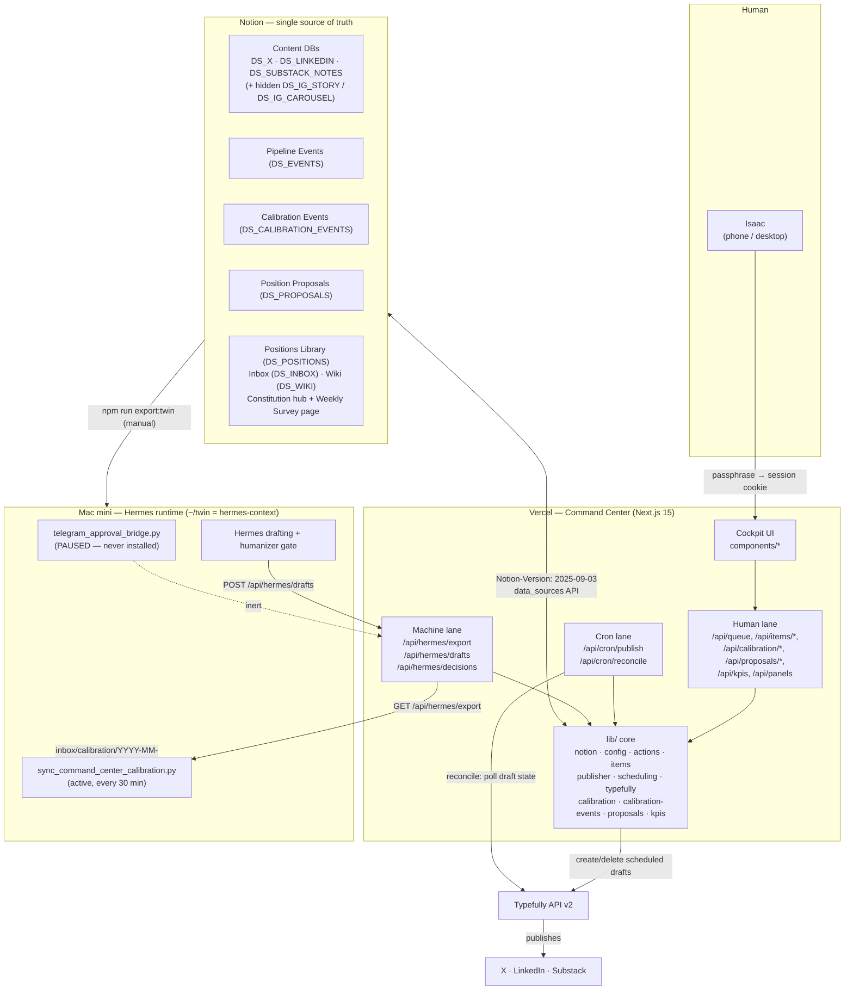
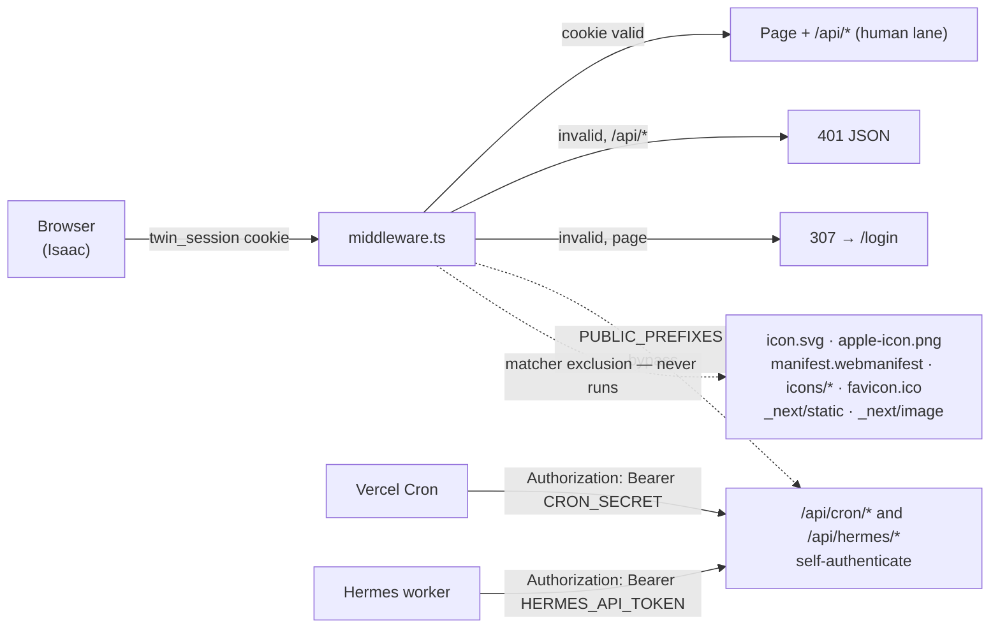
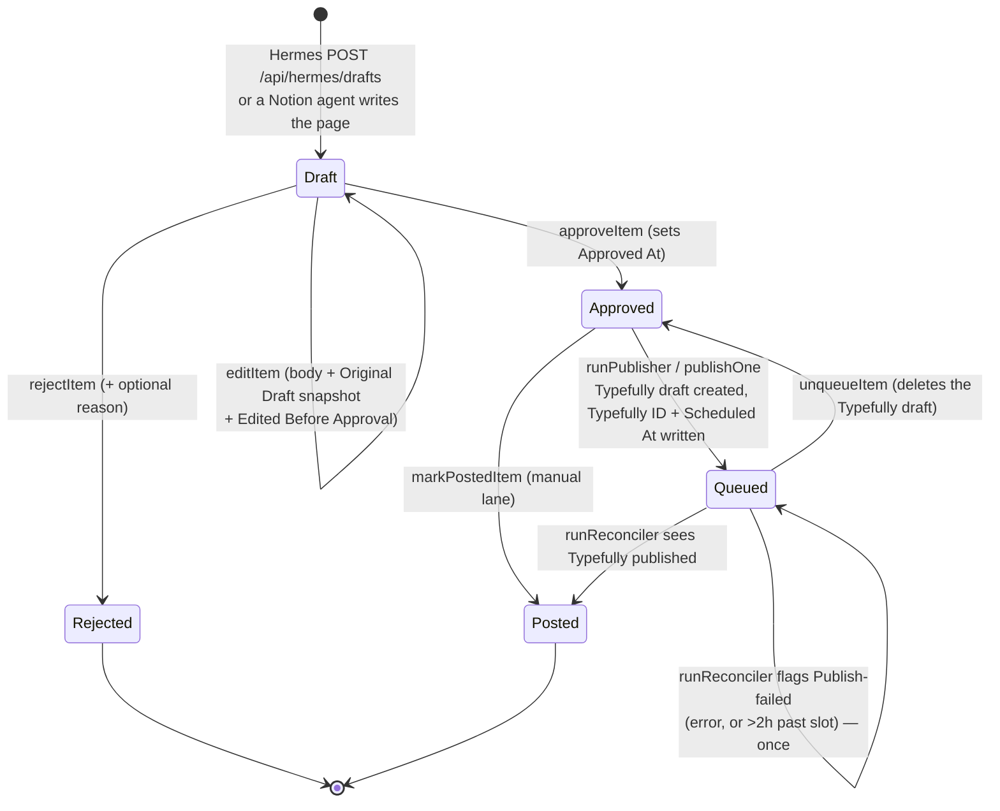
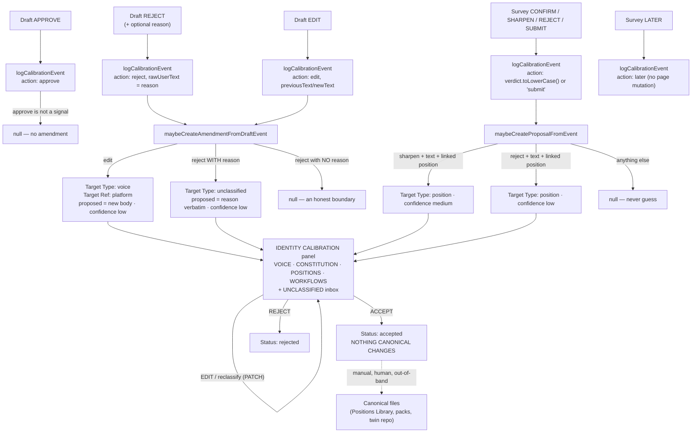
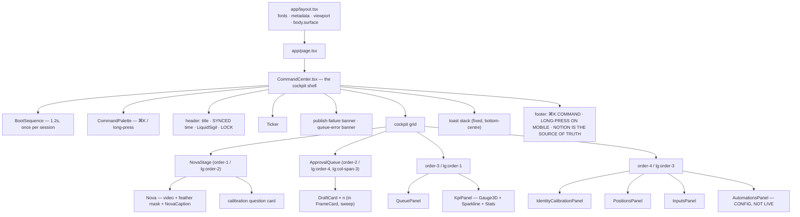

# Isaac Twin Command Center — Architecture & Rebuild Spec

> **As of:** 28 August 2026
> **HEAD:** `45023f1` — *Revert "feat: Nova speaks — opt-in in-browser TTS via kokoro-js (free, keyless)"*
> **Scope:** This document is simultaneously (a) a faithful map of the system **as built today**, and (b) a **rebuild specification**. Someone holding only this document plus access to Isaac's Notion workspace, Vercel account, Typefully account and the Mac mini should be able to rebuild the system to functional parity.
> **Method:** Every claim below was derived by reading the source at this commit. Where the prose docs in `docs/` contradict the code, **the code wins** and the contradiction is recorded in [Appendix A — Doc drift](#appendix-a--doc-drift). Anything that could not be verified from the repo is marked `UNVERIFIED:`.
> **Secrets:** No secret, token, API key, passphrase or Notion identifier value appears in this document. Environment variables are referred to by **name only**. Notion data sources are referred to by their env-var name (`DS_X`, `DS_POSITIONS`, …), never by id.

---

## Table of contents

1. [System overview](#1-system-overview)
2. [Data sources — Notion](#2-data-sources--notion)
3. [Environment & secrets inventory](#3-environment--secrets-inventory)
4. [Auth: the three lanes](#4-auth-the-three-lanes)
5. [Core workflows, end to end](#5-core-workflows-end-to-end)
6. [API surface](#6-api-surface)
7. [Frontend architecture](#7-frontend-architecture)
8. [Scheduled jobs](#8-scheduled-jobs)
9. [Hermes side (the Mac mini)](#9-hermes-side-the-mac-mini)
10. [Operational doctrine & invariants](#10-operational-doctrine--invariants)
11. [Known gaps, accepted risks, deliberately removed](#11-known-gaps-accepted-risks-deliberately-removed)
12. [Rebuild sequencing](#12-rebuild-sequencing)
- [Appendix A — Doc drift](#appendix-a--doc-drift)
- [Appendix B — Unverified items](#appendix-b--unverified-items)
- [Appendix C — File inventory](#appendix-c--file-inventory)

---

## 1. System overview

### 1.1 What the product is

The **Isaac Twin Command Center** is a phone-first web application that is the single human control surface for Isaac's AI content twin. It does three jobs:

1. **Approval** — surfaces AI-drafted social content awaiting review as a stack of cards; Isaac approves, edits, or rejects each one with a thumb.
2. **Publishing** — schedules approved content into Typefully at fixed per-platform slots, then reconciles what actually published back into Notion. Content on platforms without an auto-publish lane goes to a copy-to-clipboard manual lane instead.
3. **Identity calibration** — every approval decision and every weekly-survey answer is captured as a structured event, and deterministically converted into *reviewable pending amendments* to Isaac's canonical identity (voice / constitution / positions / workflows). Accepting an amendment marks it; it never writes to canonical identity. That stays a human act.

The application holds **no primary data**. It is a stateless Next.js app over the Notion API.

### 1.2 The actors

| Actor | Role | Where it runs |
|---|---|---|
| **Isaac** | The only human user. Approves/edits/rejects drafts, answers weekly calibration questions, accepts/rejects identity amendments, applies accepted amendments by hand. | Phone (primary), desktop |
| **Command Center** | Next.js 15 App Router app. Read/write façade over Notion, publisher/reconciler, calibration engine, machine API for Hermes. | Vercel (project name recorded in `.vercel/project.json`) |
| **Notion** | The single source of truth. Content databases, event logs, proposals, the Positions Library, the weekly survey page, the Personal Constitution hub. | Notion cloud |
| **Hermes** | The twin runtime/worker on Isaac's Mac mini. Drafts content, runs the humanizer gate, pulls the identity repo, syncs calibration reports. Never publishes, never mutates canonical identity. | Mac mini, `~/twin` → GitHub `isaacsplash18/hermes-context` |
| **Typefully** | Third-party scheduling/publishing service (API v2). Receives scheduled drafts, publishes to X / LinkedIn / Substack Notes. | Typefully cloud |
| **Other Notion agents** | Pre-existing automations that write drafts into the content DBs directly (see `automations.json`). The app must tolerate them. | Notion automations / external |

### 1.3 Top-level architecture



### 1.4 Stack

| Layer | Choice | Notes |
|---|---|---|
| Framework | Next.js `^15.1.3`, App Router, React 19 | `next.config.ts` sets only `poweredByHeader: false` |
| Language | TypeScript `^5.7`, `strict: true`, path alias `@/* → ./*` | `noEmit`; `npx tsc --noEmit` is the type gate |
| Styling | Tailwind CSS 4 (`@tailwindcss/postcss`), CSS-first `@theme` tokens in `app/globals.css` | No `tailwind.config.js` |
| Animation | `framer-motion ^11.15.0` | Card mount/exit, command palette, boot overlay |
| WebGL | `@paper-design/shaders-react` pinned `0.0.77` (Apache-2.0) | One component only, lazy-loaded |
| Fonts | `geist ^1.7.2` (Geist Mono) + `next/font/google` (Inter, Newsreader) | |
| Data | Notion official REST API via raw `fetch` | **No** `@notionhq/client` dependency. No database, no ORM, no KV, no cache layer. |
| Publishing | Typefully API v2 via raw `fetch` | |
| Scripts | `tsx ^4.19`, `dotenv ^16.4` | `npm run discover|migrate|verify:*|export:twin` |
| Hosting | Vercel + Vercel Cron | `vercel.json` |
| Tests | **None.** Convention is `scripts/verify-*.ts` + `npx tsc --noEmit` + `npx next build`. | See §10 |

---

## 2. Data sources — Notion

### 2.1 The data-sources API era (critical)

Every Notion call goes through `lib/notion.ts`, which pins:

```
Notion-Version: 2025-09-03   (overridable via NOTION_VERSION)
```

This is the **data-sources era** of the Notion API. Consequences that a rebuild must honour:

- A *database* has one or more **data sources**. The app addresses **data sources**, not databases. All `DS_*` env vars hold **data source ids**.
- Queries are `POST /v1/data_sources/{data_source_id}/query`, not `POST /v1/databases/{id}/query`.
- Schema reads are `GET /v1/data_sources/{id}`; schema patches are `PATCH /v1/data_sources/{id}` with a `properties` object.
- Page creation parents use `{ parent: { type: "data_source_id", data_source_id } }`.
- Database creation is `POST /v1/databases` with `{ parent: { type: "page_id", page_id }, title, initial_data_source: { properties } }`; the new data source id is at `db.data_sources[0].id`.

`lib/notion.ts` also provides: automatic retry (3 attempts) on `429` and `5xx` honouring `retry-after`; a per-process schema cache (`getDataSourceSchema`); case-insensitive property lookup (`findProperty`); title-property discovery (`titlePropertyName`); `cache: "no-store"` on every request.

**Pagination caveat:** `queryDataSource(dsId, body, maxPages = 5)` stops after `maxPages` (default 5 × 100 = 500 rows) and returns what it has, **with no signal**. This is a known accepted risk (§11).

### 2.2 Content databases (per platform)

Registered in `lib/config.ts` as `ALL_PLATFORMS`. Five entries; two are hidden.

| Key | Label | Env var | `autoPublish` | Body lives in | Extra prop |
|---|---|---|---|---|---|
| `x` | X | `DS_X` | `TYPEFULLY_ENABLED && TYPEFULLY_PLATFORMS.has("x")` | Page content (paragraph blocks) | — |
| `linkedin` | LinkedIn | `DS_LINKEDIN` | `TYPEFULLY_ENABLED && TYPEFULLY_PLATFORMS.has("linkedin")` | Page content | — |
| `substack` | Substack | `DS_SUBSTACK_NOTES` | `TYPEFULLY_ENABLED && TYPEFULLY_PLATFORMS.has("substack")` | Page content | — |
| `ig-story` | IG Story | `DS_IG_STORY` | **hardcoded `false`** | `IG Story Copy` (rich_text) | — |
| `ig-carousel` | IG Carousel | `DS_IG_CAROUSEL` | **hardcoded `false`** | `Caption` (rich_text) | `Slide Texts` (rich_text, read-only in UI) |

**`HIDDEN_PLATFORM_KEYS = ["ig-story", "ig-carousel"]`** (set 29 July 2026 when the Instagram drafting engines were switched off).

- `ALL_PLATFORMS` — the full registry. `platform(key)` resolves against this, so a hidden platform is still addressable by key.
- `PLATFORMS = ALL_PLATFORMS.filter(p => !HIDDEN_PLATFORM_KEYS.includes(p.key))` — **everything the app actually surfaces**: tabs, KPIs, queue lanes, publisher, reconciler, Hermes export, Hermes drafts.
- To un-hide a platform: delete its key from `HIDDEN_PLATFORM_KEYS`. Nothing else changes. The Notion DBs, `DS_IG_*` env vars, `PlatformKey` union, event names and `ALL_PLATFORMS` entries are all intact.

#### Content DB schema (all five, identical convention)

| Property | Type | Written by | Notes |
|---|---|---|---|
| *(title)* | `title` | Notion agents, `createDraft` | Name varies per DB — discovered at runtime via `titlePropertyName(schema)`. `Hook` on X/LinkedIn; `Note` on Substack Notes. **Never hardcode it.** |
| `Status` | `select` **or** `status` | Every lifecycle action | Options: `Draft`, `Approved`, `Queued`, `Posted`, `Rejected`. Both Notion property types are supported — `buildStatusUpdate()` and `statusFilter()` branch on `def.type`. An out-of-band value `In Canva` is *read* (surfaced as an `IN CANVA` badge) but never written by this app. |
| `Typefully ID` | `rich_text` | Publisher | The idempotency key. Presence ⇒ already sent to Typefully. |
| `Scheduled At` | `date` | Publisher | ISO UTC of the assigned slot. |
| `Approved At` | `date` | `approveItem` | Drives FIFO ordering and median-time-to-approval. |
| `Edited Before Approval` | `checkbox` | `editItem` | Drives the `EDITED` badge and the `Approved-with-edits` event. |
| `Original Draft` | `rich_text` | `editItem` (first edit only) | Pre-edit snapshot. Drives the `VS ORIGINAL` toggle and the approve-time diff. |
| `Created By` | `select` | `createDraft` | Options `agent`, `hermes`, `manual`. |
| `Source Workflow` | `rich_text` | `createDraft` | Free text, e.g. a pack path. |
| `Humanizer` | `select` | `createDraft` | Options `passed`, `failed`, `unknown`. **A label only** — the humanizer gate runs Hermes-side; the app records the claim, never verifies it. |
| `Source Position IDs` | `rich_text` | `createDraft` | Comma-joined Notion page ids. Not a relation, not validated. |
| `IG Story Copy` | `rich_text` | IG Story DB only | Body. |
| `Caption` / `Slide Texts` | `rich_text` | IG Carousel DB only | Body / slide texts. |

**Substack Notes** additionally carries rotation fields written by an external agent, not by this app: `Source essay` (url), `Source essay title` (text), `Lens` (select), `Char count` (number).

**Body-resolution contract** (`lib/items.ts` `readItemBody`), in order:
1. If the platform has a `bodyProp`, read it. If non-empty, that's the body.
2. If `bodyInPageContent` or `bodyProp` is set, read page content — all `paragraph` blocks joined by blank lines.
3. Otherwise fall back to the page title.

**Body-write contract** (`lib/notion.ts` `writeBody`): append new paragraph blocks *first*, then delete the old ones, so a mid-operation failure can never leave the page empty. Non-paragraph blocks are never touched. Each paragraph is chunked into multiple ≤2000-char `rich_text` items *inside one paragraph block* (via `richTextValue`), so a >2000-char paragraph is never truncated.

### 2.3 Pipeline Events (`DS_EVENTS`)

KPI-grade append-only log. Created by `npm run migrate` under the Constitution hub.

| Property | Type | Options / notes |
|---|---|---|
| `Name` | title | `"{Event} — {Platform}"` |
| `Event` | select | `Approved` (green), `Approved-with-edits` (yellow), `Rejected` (gray), `Queued` (orange), `Posted` (blue), `Publish-failed` (red) |
| `Platform` | select | `X`, `LinkedIn`, `IG Story`, `IG Carousel` — **`Substack` is missing from `migrate.ts`** and was added by hand in Notion (see Appendix A #8) |
| `Item` | url | The Notion page URL of the content item. Also used as the dedupe key by `alreadyFlaggedLate()`. |
| `Timestamp` | date | ISO now |
| `Diff` | rich_text | Only on `Approved-with-edits`: `ORIGINAL\n--------\n…\n\nAPPROVED\n--------\n…`, capped at 8000 chars |
| `Notes` | rich_text | Free text, capped at 2000 chars |

`logEvent()` warns and no-ops if `DS_EVENTS` is unset. On the action path it is wrapped in `.catch(warn)` so a transient failure can never 500 an already-committed status change.

### 2.4 Calibration Events (`DS_CALIBRATION_EVENTS`)

The rich human-signal log. Created by `npm run migrate`. Never hand-created.

| Property | Type | Options |
|---|---|---|
| `Name` | title | `"{action} — {objectType} — {topic\|objectId}"`, ≤200 chars |
| `Source` | select | `command_center`, `telegram`, `hermes` |
| `Object Type` | select | `draft`, `position`, `calibration_card`, `wiki_note` |
| `Object ID` | rich_text | Notion page id or block id |
| `Platform` | select | `x`, `linkedin`, `substack`, `ig_story`, `ig_carousel`, `unknown` (**snake_case** — the app's hyphenated keys are mapped) |
| `Topic` | rich_text | |
| `Action` | select | `approve`, `reject`, `edit`, `confirm`, `sharpen`, `submit`, `later` |
| `Raw User Text` | rich_text | Isaac's own words (reject reason, survey answer, edited body) |
| `Previous Text` | rich_text | Pre-change snapshot |
| `New Text` | rich_text | Post-change snapshot |
| `Affected Position IDs` | rich_text | Comma-joined |
| `Inferred Delta` | rich_text | `answer-recorded` / `position-confirmed` / `position-sharpened` / `position-contested` |
| `Status` | select | `pending`, `accepted`, `rejected`, `applied` |

- Every text field is truncated at **1900 chars** before write (`MAX_FIELD`).
- `createdAt` is Notion's `created_time`, **not** a custom property.
- `logCalibrationEvent()` **never throws** — it returns `null` on any failure and warns. A calibration-log failure must never break the user action that triggered it.

### 2.5 Position Proposals / Amendments (`DS_PROPOSALS`)

Despite the name, this is the general **amendment** table for the Identity Calibration layer. Created by `npm run migrate`.

| Property | Type | Options / notes |
|---|---|---|
| `Name` | title | `topic \|\| targetRef \|\| targetType`, ≤200 chars |
| `Source Event IDs` | rich_text | Comma-joined Calibration Event ids |
| `Affected Position ID` | rich_text | Empty for draft-derived amendments |
| `Topic` | rich_text | |
| `Current Position Text` | rich_text | Read-only snapshot of canonical text at generation time |
| `Proposed Position Text` | rich_text | The amendment |
| `Reason` | rich_text | Human-readable provenance sentence |
| `Evidence Summary` | rich_text | `{action} · event {id} · {ISO}`, plus a before/after excerpt for edits |
| `Confidence` | select | `low`, `medium`, `high` |
| `Status` | select | `pending`, `accepted`, `rejected`, `applied` |
| `Target Type` | select | `position`, `voice`, `constitution`, `workflow`, `unclassified` — **additive**; a row with no value reads back as `position` (back-compat) |
| `Target Ref` | rich_text | Platform key for voice/workflow amendments; free label otherwise |

`Target Type`/`Target Ref` were added later. Both the writer (`writeProposal`) and `createDraft` implement a **schema-mismatch retry**: attempt the full write, and on a Notion "not a property that exists" error, retry without the additive props and record a warning rather than failing.

### 2.6 Identity & input databases (read-mostly)

| Env var | Database | App usage |
|---|---|---|
| `DS_POSITIONS` | Positions Library | **Canonical identity.** Read by `/api/panels` (counts by `Confidence`, list where `Status = "Needs validation"`), by `readCurrentPositionText()` when generating a proposal, and by `export-twin-context.ts`. **Written only** by the survey-answer path in `lib/calibration.ts`. |
| `DS_INBOX` | Inbox | Read-only. `/api/panels` lists 12 most recent with `Status = "New"`. |
| `DS_WIKI` | Knowledge Wiki | Read-only. `/api/panels` lists 8 most recently edited. |

**Positions Library schema** (as read by the code): title property `Position`; `Status` select `Active` / `Needs validation` / `Retired`; `Confidence` select `Predicted` / `Confirmed` / `Contested`; `Last validated` date; optional rich_text `Nuance`, `Basis`, `Question`, `Articles`.

**Deterministic calibration rules** (`lib/calibration.ts` `submitAnswer`), the only automated writes to canonical identity, and only when Isaac gives a verdict on a question with a linked Position:

| Verdict | `Confidence` | `Status` | `Last validated` |
|---|---|---|---|
| Confirm | `Confirmed` | `Active` | today |
| Reject | `Contested` | `Needs validation` | today |
| Sharpen | *(unchanged)* | *(unchanged)* | today |

### 2.7 The Weekly Positions Survey page

Not a database — a Notion **page** whose blocks are parsed. Child of the Personal Constitution.

**Required block structure**, under a heading containing "this week", stopping at a heading containing "answered" or "archive":

```
## This week
*(optional italic intro paragraph — becomes roundIntro)*

1. Question title [tag]
The guess: …
Why it's flagged: …
Position: <link or @-mention to a Positions Library page>   (optional)
Your answer:                                                 (write target)
```

Parsing rules (`readSurvey`): a paragraph matching `^(\d+)\.\s+(.*)$` starts a question; a trailing `[tag]` is extracted; subsequent paragraphs are matched case-insensitively on the prefixes `the guess:`, `why it's flagged:`, `position:`, `your answer:`. The `Position:` line's page id is extracted from an `href` (32-hex or dashed-uuid) or a `mention.page.id`. The `Your answer:` block's **block id** is the write target and the `objectId` of the resulting Calibration Event.

**Write format** (`submitAnswer`) — the paragraph block is PATCHed to exactly:
`**Your answer: **` (bold) + `*{Verdict} — *` (italic, only if a verdict was given) + the answer text (≤1900 chars).

> The page id comes from `NOTION_SURVEY_PAGE`, **which is not set** — `lib/calibration.ts` falls back to a hardcoded `DEFAULT_SURVEY_PAGE` constant. See Appendix A #11: on a rebuild this must be set via env.

### 2.8 The Constitution hub page

A hardcoded page-id constant appears identically in `scripts/migrate.ts` (`HUB_PAGE_ID`) and `scripts/export-twin-context.ts` (`CONSTITUTION_HUB_PAGE_ID`). It is the parent under which `migrate.ts` creates the three log DBs, and the root that `export-twin-context.ts` walks (depth ≤ 3) to discover identity pages. It is **not** env-driven. On a rebuild, parameterise it.

### 2.9 Bootstrapping a fresh workspace

```bash
# 1. Confirm what the integration can see and that configured ids resolve
npm run discover

# 2. Additive, idempotent schema migration + DB creation
npm run migrate
```

**`scripts/discover.ts`** — read-only. Pages `POST /v1/search` filtered to `object: data_source` and prints every visible data source with its id, parent database id, and `name:type` property summary. Then, for each of a hardcoded `EXPECTED` map of `DS_*` names, fetches the configured (or fallback) id and reports the resolved title and the **Status property type** (`select` vs `status` — you need this before migrating). Finally does a seed check against a hardcoded LinkedIn *database* id to confirm MCP collection ids map 1:1 to official-API data sources.

**`scripts/migrate.ts`** — strictly additive, idempotent, safe to re-run. Three passes:

1. **Content DBs** (`CONTENT_DS` = `DS_X`, `DS_LINKEDIN`, `DS_IG_STORY`, `DS_IG_CAROUSEL`, `DS_SUBSTACK_NOTES`): add any of the nine `NEW_PROPS` that are missing (case-insensitive existence check), then ensure the five Status options exist. For a `select`-type Status it PATCHes the **full** option list, preserving existing ids/colours. For a `status`-type Status the API cannot add options, so it **prints exact manual instructions** and moves on.
2. **Log DBs**: `ensureEventsDb()`, `ensureCalibrationEventsDb()`, `ensurePositionProposalsDb()` each search-first by exact title, and create under the hub page if absent, printing the new data source id to paste into the matching `DS_*` env var. `ensurePositionProposalsDb()` additionally runs an **additive property-patch pass** on an already-existing proposals DB, adding `Target Type` / `Target Ref` if missing.
3. Every step is individually try/caught so one failure never aborts the run.

**Migration doctrine (never violate):** additive only. Never rename, never remove, never retype. Other agents write to these same DBs and match properties by name.

---

## 3. Environment & secrets inventory

All variables live in `.env` locally and must be mirrored into **Vercel → Project → Environment Variables** (Production). `.env` is gitignored; `.env.example` is committed and documents every name.

| Name | Lane | Required? | Purpose |
|---|---|---|---|
| `NOTION_TOKEN` | all | **yes** | Notion internal-integration token. The integration must be granted access to **every** DB below *and* the Constitution hub page via Notion → Connections. |
| `NOTION_VERSION` | all | no | Overrides the pinned `2025-09-03`. Leave unset unless deliberately moving API era. |
| `DS_X` | all | **yes** | X content data source id |
| `DS_LINKEDIN` | all | **yes** | LinkedIn content data source id |
| `DS_SUBSTACK_NOTES` | all | **yes** | Substack Notes content data source id |
| `DS_IG_STORY` | all | optional | IG Story content DS. Platform currently hidden; keep set so un-hiding is a one-line change. |
| `DS_IG_CAROUSEL` | all | optional | IG Carousel content DS. Same. |
| `DS_POSITIONS` | human, script | **yes** | Positions Library. `/api/panels` uses `requiredEnv` — the whole panels route 500s without it. |
| `DS_INBOX` | human | **yes** | Inbox DB. Same `requiredEnv` behaviour. |
| `DS_WIKI` | human | **yes** | Knowledge Wiki DB. Same. |
| `DS_EVENTS` | all | **gating** | Pipeline Events. Unset ⇒ `logEvent` warns and skips; KPIs go empty; `alreadyFlaggedLate` returns false. |
| `DS_CALIBRATION_EVENTS` | all | **gating** | Calibration Events. Unset ⇒ `logCalibrationEvent` returns `null`; the whole calibration layer silently degrades; export emits a warning. |
| `DS_PROPOSALS` | all | **gating** | Position Proposals / amendments. Unset ⇒ no amendment generation; the Identity Calibration panel is empty; export emits a warning. |
| `NOTION_SURVEY_PAGE` | human | **should be** | Weekly survey page id. Commented out in `.env.example` and absent from `.env`; the code falls back to a hardcoded constant. |
| `AUTH_SECRET` | human | **yes** | **sha256 hex of the login passphrase.** Not the passphrase. Compared constant-time against `sha256(submitted)`. |
| `SESSION_SECRET` | human | **yes** | HMAC-SHA256 key for the session cookie. Read by both middleware (Edge) and the login route (Node). |
| `CRON_SECRET` | cron | **gating** | Bearer secret for `/api/cron/*`. **Unset ⇒ every cron request 401s** (fail-closed). Vercel sends it as `Authorization: Bearer …`. |
| `HERMES_API_TOKEN` | machine | **gating** | Bearer secret for `/api/hermes/*`. **Unset ⇒ the entire machine lane is disabled** (all 401). Removing it from Vercel is the one-move kill switch for Hermes integration. |
| `AGENT_API_TOKEN` | machine | **gating** | Bearer secret for `/api/agent/*` (docs/AGENT-API.md). Separate from `HERMES_API_TOKEN`. **Unset ⇒ the Agent API lane is disabled** (all 401). |
| `TYPEFULLY_API_KEY` | publish | **gating** | Presence (with `PUBLISH_MODE ≠ "manual"`) is what sets `TYPEFULLY_ENABLED`. Unset ⇒ every platform is manual copy-paste. |
| `TYPEFULLY_PLATFORMS` | publish | no | Comma-separated platform keys that may auto-publish once enabled. Case-insensitive, whitespace-trimmed. **Default when unset/empty: `x`.** |
| `TYPEFULLY_SOCIAL_SET_ID` | publish | no | Pins a Typefully social set. Unset ⇒ the first social set on the account is resolved and cached per process. |
| `PUBLISH_MODE` | publish | no | Kill switch. `PUBLISH_MODE=manual` forces every platform back to the manual lane regardless of the Typefully key. |
| `TZ` | runtime | no | Present in `.env` / `.env.example`. Not read by application code — all SGT logic is fixed-offset arithmetic in `lib/scheduling.ts` plus `Intl` with an explicit `timeZone: "Asia/Singapore"`. |

**Hermes-side variables** (in `hermes/.env.example`, set on the Mac mini in `~/twin/.env`, never in Vercel):

| Name | Used by | Purpose |
|---|---|---|
| `COMMAND_CENTER_URL` | both workers | Base URL. Defaults to the production Vercel URL. |
| `HERMES_API_TOKEN` | both workers | Same token as the server's. |
| `TWIN_ROOT` | both workers | Override for the twin repo root. Defaults to two directories above the script. |
| `TELEGRAM_BOT_TOKEN` | telegram bridge (PAUSED) | Never printed or logged. |
| `TELEGRAM_CHAT_ID_ALLOWLIST` | telegram bridge (PAUSED) | Comma-separated numeric ids. Empty ⇒ fails closed. |
| `TELEGRAM_BRIDGE_POLL_SECONDS` | telegram bridge (PAUSED) | Default 300. |
| `BODY_EXCERPT_CHARS` | telegram bridge (PAUSED) | Default 600. |

### 3.1 The publish-mode decision table

```
TYPEFULLY_ENABLED = !!TYPEFULLY_API_KEY && PUBLISH_MODE !== "manual"
platform.autoPublish = TYPEFULLY_ENABLED && TYPEFULLY_PLATFORMS.has(platform.key)
                       // ...except IG, which is hardcoded false
```

| `TYPEFULLY_API_KEY` | `PUBLISH_MODE` | `TYPEFULLY_PLATFORMS` | Result |
|---|---|---|---|
| unset | any | any | Everything manual. `runPublisher()` iterates zero platforms and is a no-op. |
| set | `manual` | any | Everything manual. Key stays configured for later. |
| set | unset | unset/empty | X auto-publishes; LinkedIn and Substack manual. |
| set | unset | `x,substack` | X + Substack auto; LinkedIn manual. |
| set | unset | `none` | Nothing auto (no key matches a real platform). Prefer `PUBLISH_MODE=manual` for clarity. |

`autoPublish` is computed **once at module load**. Changing these env vars requires a redeploy/restart, not just a request.

---

## 4. Auth: the three lanes



### 4.1 Human lane — passphrase → HMAC session cookie

Implementation: `lib/auth.ts`, `app/api/auth/login/route.ts`, `app/api/auth/logout/route.ts`, `middleware.ts`, `app/login/page.tsx`.

- **Everything is Web Crypto** (`crypto.subtle`) so the identical module runs in the Node.js runtime (API routes) *and* the Edge runtime (middleware). No Node `crypto` import anywhere in the auth path. **A rebuild must preserve this** — a Node-only implementation breaks middleware.
- **Login:** `POST /api/auth/login { passphrase }`. Rate-limited to 10 attempts / 15 min per IP (in-memory `Map`, per serverless instance — best-effort). `checkPassphrase` computes `sha256hex(passphrase)` and compares it constant-time (`timingSafeEqualStr`) against `AUTH_SECRET.toLowerCase().trim()`. On success, sets the cookie and returns `{ ok: true }`; the client then hard-navigates to `/`.
- **Token format:** `base64url(JSON{exp})` + `"."` + `base64url(HMAC-SHA256(payload, SESSION_SECRET))`. TTL 30 days. Verification checks the HMAC first, then `exp > now`. There is no algorithm field, so no algorithm-confusion surface.
- **Cookie:** name `twin_session`; `httpOnly`, `sameSite: "lax"`, `path: "/"`, `maxAge` 30 days, and `secure: process.env.NODE_ENV === "production"`.
  - **Consequence a rebuild must know:** in a production build the cookie is `Secure`, so it will not be set or sent over plain `http://`. **Local previews must run through the dev server** (`npm run dev`, where `NODE_ENV !== "production"`) or over HTTPS. Running `next start` locally on `http://localhost` yields an endless login loop.
- **Logout:** `POST /api/auth/logout` clears the cookie (`maxAge: 0`).
- **Client 401 handling:** `useApi` redirects to `/login` on any `401`.

### 4.2 Cron lane — `CRON_SECRET`

Implementation: identical `authorised()` in `app/api/cron/publish/route.ts` and `app/api/cron/reconcile/route.ts`.

- Accepts **either** `Authorization: Bearer ${CRON_SECRET}` (what Vercel Cron sends) **or** the header `x-cron-secret: ${CRON_SECRET}` (for manual/webhook triggering).
- Both comparisons use `timingSafeEqualStr`.
- **Fails closed:** if `CRON_SECRET` is unset the function returns `false` immediately — every request 401s.
- Both routes export the same handler as `GET` **and** `POST` (Vercel Cron invokes with `GET`).
- Both set `maxDuration = 300` and `dynamic = "force-dynamic"`.

### 4.3 Machine lane — `HERMES_API_TOKEN`

Implementation: `lib/machine-auth.ts` `isMachineAuthorized(req)`.

- Constant-time compare of the whole `Authorization` header against the literal string `` `Bearer ${HERMES_API_TOKEN}` ``.
- **Fails closed:** unset token ⇒ `false` ⇒ every `/api/hermes/*` request 401s. This is the one-move kill switch for the entire Hermes integration.
- The token is never logged, never echoed, never included in any payload. `scripts/verify-hermes-export.ts` actively scans the whole export payload for any key matching `/token|secret|apikey|api_key|password|passphrase/i` and fails if one appears.

**Agent API lane:** a fourth, structurally identical bearer lane — `AGENT_API_TOKEN` via `isAgentAuthorized()` in `lib/machine-auth.ts`, serving `/api/agent/*` (also in `PUBLIC_PREFIXES`). It is a separate secret from `HERMES_API_TOKEN` (independent revocation; the tokens are not interchangeable). Full reference: [`docs/AGENT-API.md`](./AGENT-API.md).

### 4.4 Middleware design

```ts
const PUBLIC_PREFIXES = ["/login", "/api/auth/login", "/api/cron/", "/api/hermes/"];
```

`/api/cron/` and `/api/hermes/` are public **to the middleware** because they **self-authenticate** with their own bearer checks. The route handler is the only auth gate for those paths. **Never rely on middleware to protect them.**

For everything else: read `SESSION_SECRET`, verify the `twin_session` cookie; on failure return `401` JSON for `/api/*` paths and a `307` redirect to `/login` (with the query string stripped) for pages.

```ts
matcher: ["/((?!_next/static|_next/image|favicon.ico|icon.svg|apple-icon.png|manifest.json|manifest.webmanifest|icons/).*)"]
```

**Why the icon/manifest exclusions are load-bearing:** browsers fetch the tab favicon, and iOS/Android fetch the manifest and home-screen icons, **without cookies**. If middleware ran on those paths they would silently `307` to `/login` and the PWA would install with a blank or broken icon. `favicon.ico` stays listed even though no such file exists (the favicon is `app/icon.svg`) because browsers request `/favicon.ico` unprompted — a clean `404` beats a login redirect. `manifest.json` is a leftover, unused exclusion; the real path Next serves `app/manifest.ts` at is `/manifest.webmanifest`.

---

## 5. Core workflows, end to end

### 5.1 Draft intake → review → publish → reconcile



#### (a) Intake

Two entry points, both landing at `Status: Draft`:

1. **Hermes / any machine caller** — `POST /api/hermes/drafts` (machine lane). `lib/items.ts` `createDraft()` validates (`platform` must resolve against `PLATFORMS`, accepting snake_case aliases; `title` non-empty; `body` non-empty and ≤20,000 chars), discovers the title property, sets `Status: Draft` via `buildStatusUpdate`, writes the body to the right place per platform convention, and attaches the four provenance props with a schema-mismatch retry. Returns `201` with `{ id, url, platform, status: "Draft", warnings }`.
2. **Notion automations** — existing agents write `Draft` pages directly (`automations.json` records: *X daily drafts* (daily), *LinkedIn drafts* (Mon/Wed/Fri), *Sunday cleanup* (Sun)). The app must tolerate concurrent writers: **every action re-reads the page before writing.**

#### (b) Review

The cockpit polls `GET /api/queue` every 60 s (and on tab visibility). Per draft card the actions are:

- **APPROVE** → `POST /api/items/{pageId}/approve`.
  - Guard: `status !== "Draft"` ⇒ `ActionError(409)`.
  - Writes `Status: Approved` + `Approved At`. If `Approved At` is missing (pre-migration DB) it retries with status alone and warns rather than blocking.
  - Logs Pipeline Event `Approved` — or `Approved-with-edits` **with a diff** if `Edited Before Approval` is set — non-fatally.
  - Logs a Calibration Event (`action: approve`, `objectType: draft`).
  - **UI side effect:** the client copies the approved body to the clipboard *inside the tap gesture* (a browser requirement) and toasts `COPIED — PASTE & POST, THEN MARK POSTED`, so the manual lane needs no second tap. It also fires a `twin-pulse: approve` event and optimistically removes the card.
- **REJECT** → reveals an inline reason row (one extra tap max). `REJECT` sends `{ reason }`; `SKIP` sends no body. Both `POST /api/items/{pageId}/reject`. `Enter` confirms, `Escape` cancels.
- **EDIT** → inline autosizing textarea with a per-platform character counter and a `VS ORIGINAL` toggle (shown only when `Original Draft` exists). `SAVE` → `POST /api/items/{pageId}/edit { text }`.
  - **Ordering is load-bearing** (`editItem`): for block-bodied platforms the `Original Draft` snapshot and `Edited Before Approval` flag are persisted **before** `writeBody`, so a failure between them can never leave the body changed with the true original unsaved. For `bodyProp` platforms the body and the snapshot go in one `updatePage`. Both paths have a pre-migration fallback (warn, write body only).

Character limits (`components/ApprovalQueue.tsx`, advisory only — nothing is blocked):

| Platform | Limit | Hard? | Over-limit colour |
|---|---|---|---|
| `x` | 280 | yes | oxbright |
| `linkedin` | 3000 | no | amber |
| `substack` | 600 | no | amber — *a voice guardrail, not the platform's 10,000 ceiling* |

#### (c) Publish

`lib/publisher.ts` `runPublisher()`, invoked by the cron and by the `PUBLISH NEXT SLOT` override:

1. For each platform in `PLATFORMS.filter(p => p.autoPublish)`:
2. Load `Approved` items (with bodies) and the `Scheduled At` values of `Queued` items in parallel. A query failure records a `failed` entry and skips the platform — it never aborts the run.
3. Sort **FIFO** by `Approved At ?? createdTime`.
4. **Idempotency:** any item already carrying a `Typefully ID` is counted as `skipped` and never re-sent.
5. `scheduleOne()`: resolve the body → compute the next free slot → `POST` a Typefully scheduled draft → write `Status: Queued` + `Typefully ID` + `Scheduled At` back to Notion → log Pipeline Event `Queued`.
6. **Rollback on failed Notion write** (a hard-won fix): if the Typefully draft was created but the Notion write throws, the idempotency guard can't see it and the next run would double-schedule a public post. So the code calls `deleteDraft(draft.id)` to roll the Typefully side back, leaving the item cleanly `Approved` and retryable. If the rollback *also* fails, it logs a `Publish-failed` Pipeline Event whose notes carry the **orphaned Typefully draft id** for manual cleanup, then rethrows.
7. Any other failure logs `Publish-failed` and leaves the item `Approved` for the next run.

**Slot mathematics** (`lib/scheduling.ts`). All cadence logic is in **SGT (Asia/Singapore, UTC+8, no DST)**, done as fixed-offset arithmetic — deliberately, because a no-DST zone makes offset math safe.

| Platform | Days (SGT) | Time (SGT) | Rationale |
|---|---|---|---|
| `x` | every day | 08:30 | |
| `linkedin` | Mon / Wed / Fri | 09:00 | |
| `substack` | every day | 21:00 | = 09:00 US Eastern, where most Substack readership is |

`nextFreeSlot(platform, now, takenIso)` probes forward up to 90 SGT calendar days, skipping days not in the cadence, slots less than **`LEAD_MS` = 10 minutes** away, and slots already taken (millisecond-exact set membership over currently-`Queued` items plus slots assigned earlier in the same run). Throws if no slot is found in 90 days.

**Typefully client** (`lib/typefully.ts`, API v2, `https://api.typefully.com`):

- Auth `Authorization: Bearer ${TYPEFULLY_API_KEY}`.
- Social set: `TYPEFULLY_SOCIAL_SET_ID` if pinned, else `GET /v2/social-sets` and take the first, cached per process.
- Create: `POST /v2/social-sets/{id}/drafts` with `{ platforms: { [key]: { enabled: true, posts } }, publish_at: <ISO> }`.
  - **X** splits the body on the explicit thread marker `\n\n---\n\n` into thread posts.
  - **LinkedIn and Substack** are always a single post — Notes have no thread concept, so the marker is deliberately not honoured.
- State: `GET /v2/social-sets/{id}/drafts/{draftId}`. `getDraftState` normalises **both** the legacy `status` field and the current `publish_state` field into one shape: `status === "published"` when either `status === "published"` **or** `publish_state === "finished"`. Published URL is read from `x_published_url ?? linkedin_published_url ?? substack_published_url`.
- Delete: `DELETE /v2/social-sets/{id}/drafts/{draftId}`.

**The manual lane.** Any visible platform whose `autoPublish` is false routes `Approved` items to the `manual` bucket in `/api/queue`, surfaced as **APPROVED — POST MANUALLY** with `COPY` and `MARK POSTED` buttons. `markPostedItem` guards on `status === "Approved"`, sets `Posted`, and logs a `Posted` Pipeline Event with notes `"Posted manually"`.

#### (d) Reconcile

`runReconciler()`, hourly. For each auto-publish platform, for each `Queued` item whose `Scheduled At` is in the past **and** which carries a `Typefully ID`:

- Poll Typefully. A lookup failure logs and skips (no state change).
- `published` ⇒ set `Status: Posted` and log a `Posted` Pipeline Event with the published URL in notes.
- `error`, **or** more than **2 hours** past the slot ⇒ log a `Publish-failed` Pipeline Event — but only if `alreadyFlaggedLate(itemUrl)` finds no existing `Publish-failed` event for that item URL. **This is what makes the hourly re-run idempotent.**

Publish failures surface in two places: the red banner at the top of the cockpit (via `/api/panels`, 48-hour window) and `publisher.failures24h` in the Hermes export.

### 5.2 Identity calibration



**Generation is deterministic — there is no LLM anywhere in this path.** The rules, in full:

| Trigger | Condition | Result |
|---|---|---|
| Draft `edit` | `newText` non-empty | `targetType: voice`, `targetRef: <platform>`, `proposedText` = the new body verbatim, evidence = `BEFORE:`/`AFTER:` excerpts (400 chars each), confidence `low` |
| Draft `reject` | reason non-empty | `targetType: unclassified`, `targetRef: <platform>`, `proposedText` = the reason verbatim, confidence `low` |
| Draft `reject` | **no** reason | `null` — no signal, no amendment |
| Draft `approve` | any | `null` — approval is not a calibration signal |
| Survey `sharpen` | `rawUserText` **and** ≥1 affected position | `targetType: position`, confidence `medium` |
| Survey `reject` (verdict) | `rawUserText` **and** ≥1 affected position | `targetType: position`, confidence `low` |
| Everything else | | `null` — **never guess** |

**Idempotency:**
- Draft amendments: query-before-create on `Source Event IDs contains <event id>` **and** `Status = pending`. Each edit/reject creates a fresh Calibration Event, so a repeat action legitimately generates a new amendment.
- Survey proposals: query-before-create on `Affected Position ID = <id>` **and** `Status = pending`. v1 does not merge multiple events into one proposal.

**Fire-and-forget safety:** both generators warn and return `null` when `DS_PROPOSALS` is unset, and **never throw**. Generation runs *after* the user's action has already committed, so a generation failure can never fail the action.

**The `accepted ≠ applied` doctrine.** `setProposalStatus()` flips one Notion select and does nothing else. There is **no code path anywhere in this repo** that writes an amendment into the Positions Library, the survey page, the voice/constitution packs, or the twin repo. `applied` exists as a status value but is unreachable — reserved for a future, explicitly separate human-triggered action. The UI states this permanently: *"Accepted amendments are never auto-applied — canonical files change only when Isaac applies them."* The accept toast reads `ACCEPTED — CANONICAL FILES UNCHANGED UNTIL ISAAC APPLIES`. The Hermes report repeats it under a heading literally titled **"Accepted, not yet applied."**

### 5.3 Weekly positions survey (via NovaStage)

1. `GET /api/calibration` → `readSurvey()` parses the survey page (§2.7).
2. `NovaStage` filters to questions that have an `answerBlockId`, no `existingAnswer`, and haven't been submitted this session. **One question at a time**, floating over Nova's lower edge. Skipped questions rotate to the back of the local queue.
3. While a question is up, Nova's typed caption goes blank — *the card is her voice at that point*.
4. `SUBMIT` → `POST /api/calibration/answer { answerBlockId, text, verdict?, positionPageId? }`. Text is mandatory (`"Write your actual view — messy is fine."`); the verdict is optional.
   - Writes the answer paragraph (§2.7) — this is the contract the Sunday review reads.
   - Deterministically calibrates the linked Position if a verdict was given (§2.6). A calibration write failure is caught and warned; **the answer is saved either way**.
   - Logs a Calibration Event. `Confirm` is logged with `status: accepted` (the deterministic calibration above already applied it); everything else stays `pending`.
   - Calls `maybeCreateProposalFromEvent`.
5. `LATER` → fire-and-forget `POST /api/calibration/later { objectId, topic }`. **No page mutation** — just an inspectable `later` event so the pattern of which questions keep getting skipped becomes visible.
6. Response toast: `ANSWER SAVED — POSITION CALIBRATED` or `ANSWER SAVED TO THE SURVEY`.

### 5.4 Hermes export + the Mac-mini sync worker

**`GET /api/hermes/export?since=<ISO>&limit=<n>`** — machine lane, read-only, **never mutates Notion**.

- `since` defaults to 7 days ago; unparseable values fall back silently. Filters `events` only.
- `limit` defaults to 100, clamped to 200. Affects `events` only.

Response (`version: 1`):

```jsonc
{
  "version": 1,
  "generatedAt": "<ISO>",
  "since": "<resolved ISO>",
  "events":    [ /* CalibrationEvent[], newest first */ ],
  "proposals": { "pending": [ /* … */ ], "accepted": [ /* … */ ] },
  "drafts":    { "pendingReview": 0 },
  "publisher": { "mode": "manual" | "typefully", "failures24h": 0, "autoPlatforms": ["x"] },
  "warnings":  [ "<string>" ]
}
```

**Per-lane degradation** — the defining property of this endpoint. Each of the four data lanes has its own `.catch`; an unconfigured env var or a transient Notion error on one lane yields an empty result **plus a `warnings` entry**, never a 500. The draft-count loop degrades per platform, and a `"not found for property"` error (an unmigrated Status option) is treated as *not a failure* and produces no warning at all. `warnings` is always present, so a consumer can distinguish "genuinely zero" from "not wired up yet".

**Versioning contract:** additive fields do not bump `version`. `targetType`/`targetRef` on proposals, `failures24h` and `autoPlatforms` on `publisher` were all added additively at `version: 1`. Any removal, type change, or semantic change bumps it.

**The sync worker** — `hermes/scripts/sync_command_center_calibration.py`. Python 3, **standard library only** (the Mac mini runs plain `python3`; no pip). Cadence: right after the existing 30-minute `pull_identity.sh`.

```bash
cd ~/twin
./scripts/pull_identity.sh
python3 scripts/sync_command_center_calibration.py
```

Contract:

- **State file:** `<twin root>/inbox/calibration/.calibration-sync-state.json`, holding `{ since, reportHash, seenIds }`. A corrupt/unreadable state file is treated as "first run" rather than crashing a cron log.
- **Watermark:** `since` is the **max `createdAt` across returned events**, *not* `generatedAt`. `generatedAt` is stamped after the events list is snapshotted, so events created in that gap would be skipped forever. Falls back to the previous watermark when no events came back.
- **`seenIds`:** the ids recorded *at* the watermark. Because the next query is `on_or_after`, boundary events reappear in the overlap window; `seenIds` drops them so nothing is double-reported.
- **Quiet when unchanged:** `reportHash` is a SHA-256 over `{proposals, drafts, publisher, warnings}` — everything that is *not* the new-events window. The run exits `0` silently only when the hash is unchanged **and** there are no new events. Otherwise it writes `inbox/calibration/YYYY-MM-DD.md` and prints exactly one line: `calibration report written: inbox/calibration/YYYY-MM-DD.md`.
- **Validation:** a small explicit validator (no schema library) checks `version === 1`, ISO parseability of `generatedAt`/`since`, and every field of every event and proposal by name and type. Failure ⇒ exit `3`, nothing written.
- **Report sections:** *New calibration events* (grouped by action in a fixed order), *Pending proposals*, *Accepted, not yet applied*, *Needs Isaac review*, *Warnings from the export*.
- **Guardrails, verbatim:** never edits `soul.md` / `constitution.md` / `context.md` / `memory.md` / `packs/` — only ever writes under `inbox/calibration/`. Never applies a proposal. Never publishes. Never prints or logs `HERMES_API_TOKEN`.

| Exit | Meaning |
|---|---|
| `0` | Report written, or nothing changed (silent) |
| `2` | `HERMES_API_TOKEN` not set on a real run |
| `3` | Export failed validation — nothing written |
| `4` | Network error, timeout, malformed JSON, fixture read error |
| `5` | `--fixture` passed without `--dry-run` (refused before anything happens) |

**Dry-run conventions:** `--dry-run` fetches, validates, prints the report to stdout, and **writes nothing** (no state, no report). Without a token, `--dry-run` prints a clearly labelled `NO TOKEN — showing structure only` skeleton instead of exiting, so the report shape is visible before the token is wired. `--fixture <path>` reads the export JSON from a local file and never touches the network — **test-only**, and hard-refused (exit `5`) without `--dry-run`, because a fixture's `generatedAt` would corrupt the next real run's window.

### 5.5 KPIs and the ticker

**KPIs** (`lib/kpis.ts`, `GET /api/kpis?window=7|28`, polled every 120 s):

- Pull Pipeline Events since `now − windowDays`.
- A "decision" = `Approved` + `Approved-with-edits` + `Rejected`. Rates are `null` when the denominator is zero (rendered as `—`, never `0%`).
- `untouchedApprovalRate = Approved / decisions` — the headline gauge; it measures how often the twin got it right first time.
- `editRate`, `rejectionRate` likewise. Computed overall and per platform (matched on the Pipeline Events `Platform` label = `PlatformConfig.label`).
- `publishFailures` = count of `Publish-failed` events in window.
- `draftsProduced` / `draftsPerWeek` / `medianTimeToApprovalHours` come from the **content DBs** (`created_time` on/after `since`, and `Approved At − created_time`). A platform DS being unavailable is caught per platform so it can't zero out the panel. The median takes the upper-middle element on even counts (noted, not a bug).
- `dailyDecisions` / `dailyApprovals` are `windowDays`-length buckets for the sparkline, with an explicit `idx < 0 || idx >= windowDays` guard.

**Ticker** (`components/Ticker.tsx`, driven from `CommandCenter`): a one-line mono strip cycling real pipeline facts every 6 s — draft count awaiting review, the next few queued items with their SGT slot times, approved-awaiting-scheduler count, manual-lane count, the two most recent posted titles, and a publish-failure warning. Falls back to `Systems nominal — queue clear`, and to `ISAAC TWIN // COMMAND CENTER` before data loads. **Never decorative filler** — every line is derived from real state.

---

## 6. API surface

`dynamic = "force-dynamic"` on every route. Human-lane routes are protected by middleware; cron and machine routes self-authenticate.

### Human lane (session cookie)

| Path | Method | Request | Response | Errors |
|---|---|---|---|---|
| `/api/auth/login` | POST | `{ passphrase }` | `{ ok: true }` + `Set-Cookie` | `401` wrong passphrase; `429` rate-limited |
| `/api/auth/logout` | POST | — | `{ ok: true }` + cleared cookie | — |
| `/api/queue` | GET | — | `{ drafts, manual, approved, queued, posted, rejected, fetchedAt, warning? }` | `500` |
| `/api/panels` | GET | — | `{ positions: {total, confidenceCounts, activeCount, needsValidation}, inbox, wiki, publishFailures }` | `500` |
| `/api/kpis` | GET | `?window=7\|28` (anything but `28` ⇒ 7) | `Kpis` | `500` |
| `/api/calibration` | GET | — | `{ pageUrl, roundIntro, questions[] }` | `500` |
| `/api/calibration/answer` | POST | `{ answerBlockId, text, verdict?, positionPageId? }` | `{ ok: true, calibrated: boolean }` | `400` missing `answerBlockId` or empty `text`; `500` |
| `/api/calibration/later` | POST | `{ objectId, topic? }` | `{ ok: true }` | `400` missing `objectId` |
| `/api/calibration-events` | GET | `?limit=<≤100>&since=<ISO>` | `{ events: CalibrationEvent[] }` | `500` |
| `/api/proposals` | GET | `?status=<pending\|accepted\|rejected\|applied>&limit=<≤100>` | `{ proposals: PositionUpdateProposal[] }` | `500` |
| `/api/proposals/[id]` | PATCH | `{ proposedText?, targetType?, targetRef? }` | updated proposal | `400` bad type / invalid `targetType` / empty patch; `409` status ≠ `pending` |
| `/api/proposals/[id]/accept` | POST | — | updated proposal (`accepted`) | `409` status ≠ `pending` |
| `/api/proposals/[id]/reject` | POST | — | updated proposal (`rejected`) | `409` status ≠ `pending` |
| `/api/items/[pageId]/approve` | POST | — | the updated `ContentItem` | `400` page not in a configured DB; `409` status ≠ `Draft` |
| `/api/items/[pageId]/reject` | POST | `{ reason? }` (body optional) | `{ ok: true }` | `409` status ≠ `Draft` |
| `/api/items/[pageId]/edit` | POST | `{ text }` | `{ ok: true, body }` | `400` non-JSON body or empty text; `409` status ≠ `Draft` |
| `/api/items/[pageId]/mark-posted` | POST | — | `{ ok: true }` | `409` status ≠ `Approved` |
| `/api/items/[pageId]/unqueue` | POST | — | `{ ok: true }` | `409` status ≠ `Queued` |
| `/api/items/[pageId]/publish-next` | POST | — | `{ slot, typefullyId }` | `400` IG / page not in a configured DB; `409` status ≠ `Approved` or already in Typefully |

### Cron lane (`Bearer CRON_SECRET` or `x-cron-secret`)

| Path | Method | Response |
|---|---|---|
| `/api/cron/publish` | GET, POST | `{ scheduled: [{pageId, platform, slot, typefullyId}], failed: [{pageId, platform, error}], skipped: number }` |
| `/api/cron/reconcile` | GET, POST | `{ posted: string[], late: string[], checked: number }` |

Both `401` on a bad/missing secret and `500` on an unexpected throw.

### Machine lane (`Bearer HERMES_API_TOKEN`)

| Path | Method | Request | Response | Errors |
|---|---|---|---|---|
| `/api/hermes/export` | GET | `?since=<ISO>&limit=<≤200>` | the v1 export object (§5.4) | `401`, `500` |
| `/api/hermes/drafts` | GET | `?status=pending` (only value supported) | bare array `[{pageId, platform, title, body, humanizer, createdBy, createdAt}]`, newest first, degrading per platform | `400` other status; `401`; `500` |
| `/api/hermes/drafts` | POST | `{ platform, title, body, sourcePositionIds?, sourceWorkflow?, humanizerStatus?, createdBy? }` | `201 { id, url, platform, status: "Draft", warnings }` | `400` validation; `401`; `500` |
| `/api/hermes/decisions` | POST | `{ pageId, action: "approve"\|"reject"\|"edit", editedText?, reason?, source?, idempotencyKey? }` | `200 { ok, pageId, action, status, noop, idempotencyKey? }` | `400` validation; `401`; other `ActionError` statuses pass through; `500` |

### Agent API lane (`Bearer AGENT_API_TOKEN`)

`/api/agent/{state,drafts,kpis,proposals}` plus `POST /api/agent/items/[pageId]/{approve,reject,edit,mark-posted,publish-next}` and `POST /api/agent/proposals/[id]/{accept,reject}` — all responses `{ version: 1, … }`, errors `{ error }`. Wraps the same `lib/` cores as the human lane (calibration source `agent`). Full endpoint reference, idempotency rules and curl examples: [`docs/AGENT-API.md`](./AGENT-API.md).

### Error conventions

- **`handleAction`** (`lib/route-helpers.ts`) wraps most human-lane mutations: an `ActionError` becomes `{ error }` at its own status; anything else is `console.error`'d and returned as `500 { error: err.message }`.
- **`ActionError`** defaults to **`409`**. `409` is the universal "this item has already moved on" signal, produced by re-reading the page before every write. `400` is used for structurally-invalid input (bad JSON, empty body, page not in a configured DB).
- **`/api/hermes/decisions` 409 → 200 noop semantics.** For the machine lane, "someone already decided this" — a duplicate reply, or Isaac deciding in the web UI first — is a **success, not a failure**. A `409` from the wrapped action is translated into `200 { ok: true, noop: true, note: "already-decided", status: <re-read status or null> }`. Every other error passes through unchanged. This is what makes re-POSTing the same decision replay-safe. Idempotency in v1 is **status-based**, not key-based; `idempotencyKey` is accepted and echoed for the caller's logs only.
- **`edit` on the machine lane is one logical EDIT-APPROVE**: `editItem` then `approveItem`. One reply = one decision. It produces both an `edit` and an `approve` Calibration Event, and a Pipeline Event of `Approved-with-edits`.
- `source` on the machine lane defaults to `"telegram"`; an explicit valid value overrides. An invalid value falls back rather than erroring — `source` is a log tag, not authorization.
- **Note on `/publish-next`:** `publishOne()` now throws `ActionError` for its guards (`400` IG items / unconfigured page, `409` not `Approved` / already in Typefully), so they no longer surface as `500` (fixed with the Agent API).
- Raw `err.message` reaches 500 bodies — an accepted LOW risk (§11).

---

## 7. Frontend architecture

### 7.1 Component map



### 7.2 The cockpit grid and mobile ordering

```
grid grid-cols-1 gap-4 lg:grid-cols-[300px_minmax(0,1fr)_300px]
```

Four grid children, each carrying a mobile `order-*` and an `lg:order-*` override:

| Item | mobile order | lg order | lg placement |
|---|---|---|---|
| Nova / NovaStage | 1 | 2 | column 2 |
| Approval Queue | 2 | 4 | row 2, `lg:col-span-3` (full width) |
| Queue & Posted + KPIs | 3 | 1 | column 1 |
| Identity Calibration + Positions + Inputs + Automations | 4 | 3 | column 3 |

**Why this shape:** the approval queue is the #1 daily action. It used to be a plain sibling `<div>` *below* the grid, which meant it was always dead last on mobile regardless of `order-*` classes — it wasn't a grid child at all. Making it the fourth grid child with `order-2 lg:order-4 lg:col-span-3` puts it directly under Nova on a phone while CSS Grid's order-modified row-major auto-placement reproduces the original three-column desktop layout exactly (order 1/2/3 fill row 1; order-4 with `col-span-3` doesn't fit and drops to row 2 full-width). `lg:mt-2` restores the original 24px desktop gap (16px grid row-gap + 8px), and is `lg:`-only so mobile keeps the uniform 16px rhythm.

**`grid-cols-1` is load-bearing on mobile.** Without an explicit `minmax(0,1fr)` track the implicit column auto-sizes to its widest child (the calibration card's `max-w-xl`) and overflows the viewport.

### 7.3 Nova — the centrepiece

`components/Nova.tsx`. A full-bleed holographic video of the twin's face. There is no card, no frame, no visible rectangle.

- **Full-bleed break-out:** the `<section>` uses the classic `relative left-1/2 w-screen -translate-x-1/2` trick to escape `<main>`'s padding on mobile, and reverts to `lg:static lg:w-full lg:translate-x-0` inside the centre grid column on desktop. `<body>` carries `overflow-x-hidden` to guard against `100vw` including the scrollbar gutter and tripping a 1px horizontal scrollbar on desktop.
- **Feather mask:** two mask layers intersected (`maskComposite: "intersect"` / `WebkitMaskComposite: "source-in"`) — a top-to-bottom linear gradient (`transparent 0% → black 12% → black 46% → transparent 86%`) and a figure-biased radial ellipse (`ellipse 70% 84% at 50% 40%, black 52%, transparent 96%`). She dissolves into the page ground on every side. Two overlay divs add a bottom fade **anchored on `var(--color-ground)`** (so it tracks the theme token rather than a hardcoded dark patch) and a restrained oxblood rim light in `screen` blend mode.
- **The vertical-crop lesson (hard-won).** The wrapper is `aspectRatio: 1 / 0.92` (the original `1 / 1.15` box shrunk 20% shorter), `maxHeight: 90vh`. **A naive box shrink does not crop the video vertically** — with `object-fit: cover` the fit here is height-driven, so shrinking the box just crops the *sides*. The working approach: size the `<video>` to `height: 125%` of the shorter box (1.25 × 0.92 = 1.15, i.e. pixel-identical framing to the old box), pin it to `left-0 top-0`, and let the wrapper's `overflow-hidden` clip exactly the bottom 20%. `objectPosition` stays centred.
- **Playback state machine.** `loop` is deliberately **not** set on the `<video>`. On every fresh mount the clip plays through once in full, then `enterTail()` seeks back to `duration − TAIL_SECONDS` (2 s) and loops just that breathing end-state forever.
  - `TAIL_SECONDS = 2` on purpose: a sub-second tail makes the decoder re-seek twice a second, which stutters on mobile.
  - **Two loop-back drivers are attached unconditionally, not either/or.** `requestVideoFrameCallback` is the precise, frame-accurate one but can go silent in background tabs, some WebViews, and headless/preview contexts — which would freeze the clip on its last frame forever. `timeupdate` (~4/sec) is the coarse backstop. Both funnel through the same idempotent `maybeLoopTail()` guard (`currentTime >= duration − 0.03`), so whichever fires second is a no-op. `fastSeek`/`requestVideoFrameCallback` are feature-checked via `typeof`, because the TS lib types them as always-present while real support varies.
  - **Reduced motion:** the video is paused and seeked to `duration − 0.05` — the same settled end-state — so both modes agree on what "settled" looks like. Never blank.
- **Mood + pulse system.** A global `twin-pulse` CustomEvent (`components/types.ts` `twinPulse(kind)`) carries `"approve"` or `"error"`. Nova listens on `window` and runs a single `requestAnimationFrame` loop that eases a drop-shadow glow toward a target: `approve` blooms the glow to 1; `error` blooms it *and* tints red for 800 ms *and* applies a random ±2.5px horizontal shudder for 600 ms. Base glow by mood: `praise` 0.22, `neutral` 0.08, `sass` 0.04. A cursor-driven `rotateY` tilt was **deliberately removed** — it made her read as a rigid slab, fighting the edgeless framing.
- **`NovaCaption`:** a typed speech line (2 chars / 18 ms) in a self-contained dark chip overlaid on the lower video, above the mask so it stays crisp. Deliberately not a full-width scrim — anything wider than the text reads as a stray rectangle over a floating hologram. Colour pinned to Splash "clay" regardless of theme, because the chip is a lit screen. **Silent when blank** — while a calibration question is up, the card is her voice.
- **`novaVoice.ts` is the mood engine, not speech.** `novaState(queueData)` picks a mood and a rotating set of lines **from real pipeline statistics only** (posts this week, drafts pending, manual-lane age). She talks trash when nothing ships (`sass`), glorifies when it does (`praise`). Lines rotate every 14 s. This file has **nothing to do with TTS** — see §11.

### 7.4 The glass / `surface` design system

`app/globals.css`, Tailwind 4 `@theme` block.

**Palette** — Splash Co. brand tokens, light "still water" surface:

| Token | Value | Brand name |
|---|---|---|
| `--color-ground` | `#f2f2ef` | plate |
| `--color-panel` | `#e8e8e3` | clay |
| `--color-ink` | `#191a1c` | graphite |
| `--color-ink-dim` | `#6b6e70` | slate |
| `--color-slate` | `#8c9093` | titanium |
| `--color-hairline` | `rgba(25,26,28,0.14)` | — |
| `--color-hairline-faint` | `rgba(25,26,28,0.07)` | — |
| `--color-oxblood` | `#7d0607` | oxblood (unchanged across themes) |
| `--color-oxbright` | `#a61b1c` | the scarcity accent |
| `--color-phosphor` | `#3f6b3f` | bespoke status tone |
| `--color-amber` | `#7d6a3a` | bespoke status tone |

**Glass tokens:** `--glass-tint: 232 232 227` (channel triplet), `--glass-alpha: 0.62`, `--glass-blur: 16px`, `--glass-saturate: 1.4`, `--glass-specular`, `--glass-edge`.

- **CSS syntax lesson:** the background **must** be `rgb(var(--glass-tint) / var(--glass-alpha))`. The intuitive `rgba(var(--tint), var(--alpha))` mixes comma and space-separated color syntax, is invalid CSS, and computes to fully transparent — verified in-browser: `backdrop-filter` applied, background stayed `rgba(0,0,0,0)`.
- `.glass` layers an inset specular top edge, an inset refraction hairline, and a two-part float shadow. `.glass::after` adds a faint 135° diagonal sheen in `screen` blend mode, `pointer-events: none`.
- **Degradation matrix:** `@supports not (backdrop-filter…)` ⇒ opaque clay. `@media (max-width: 640px)` ⇒ cheaper frost (8px blur, alpha 0.78, saturate 1.2) so many simultaneous panels don't jank iOS Safari. `prefers-reduced-motion` ⇒ sheen removed, frost kept.
- **Single choke point:** `FrameCard`'s `glass` prop defaults to `true`. Setting it false on one card, or flipping the default, is the app-wide kill switch. The non-`FrameCard` glass surfaces are the header, `Ticker` (lighter variant via inline custom-property overrides), the command palette, and toasts.

**`.surface`** — the page ground. One class on `<body>`; removing it leaves plain plate. It is a single soft gradient, **untextured by request**: nothing repeating, nothing animated. Delivered on a `position: fixed; z-index: -1; pointer-events: none` `::before` pseudo-layer rather than a body background, for three reasons: it paints behind all content so it lands *inside* every `.glass` panel's backdrop sample (the frost has something to refract); `fixed` is viewport-anchored on scroll without `background-attachment: fixed`'s iOS bugs; and fixed boxes don't contribute to scrollable overflow so it can't trip a scrollbar. The gradient is radial rather than linear (bands fall on curves, not straight across the viewport) with deliberately far-apart stops (0/34/58/100), because tight stops over a small delta is exactly what bands on 8-bit displays. Measured swing ≈5% luminance.

**Fonts** (`app/layout.tsx`):

| Variable | Face | Role |
|---|---|---|
| `--font-mono` | Geist Mono (via the `geist` package) | ~90% of the chrome: labels, statuses, timestamps, buttons |
| `--font-sans` | Inter 400/600 (`next/font/google`) | Headings, UI body |
| `--font-serif` | Newsreader, normal + italic (`next/font/google`) | **Draft bodies.** The content is the hero — it should read like writing. |

Inter replaced Schibsted Grotesk and Geist Mono replaced IBM Plex Mono in a legibility pass: both have a taller x-height and open apertures at small on-screen sizes, which is where this UI lives. Only the weights actually used are loaded. **11px is the floor** for any text — a typography comfort pass raised every 9–10px label.

**Motion:** `FrameCard` mounts with a 250 ms border trace (top+left, then right+bottom at +125 ms), Arwes-style frame corners fading in at +200 ms, and a 150 ms content fade — staggered 40 ms per `index`, capped at 12. Exit on approve runs a swift oxblood sweep (`sweep` prop) plus a 20px x-translate. `useReducedMotion()` collapses all of it. `dot-pulse` (2 s) runs **only** on `QUEUED` status dots. `ticker-item` is a 6 s fade. All keyframe animations are killed under `prefers-reduced-motion`, along with `scroll-behavior`.

**`LiquidSigil`** — the one WebGL moment. `@paper-design/shaders-react`'s `LiquidMetal`, `shape: "diamond"`, `colorTint: "#A61B1C"`, transparent background. Mounted **only** via `next/dynamic({ ssr: false })` at its two call sites (the header at 28px, the boot overlay at 160px), so the shader chunk never lands in the main bundle or SSR output. Measured: 37.3 KB raw / 11.8 KB gzipped, under a 45 KB budget. Under `prefers-reduced-motion` it renders a single static frame (`speed = 0`) rather than tearing the canvas down.

### 7.5 PWA icons vs favicon

| Asset | Purpose | Notes |
|---|---|---|
| `app/icon.svg` | Browser-tab favicon | A hand-authored static SVG of the LiquidSigil mark: an oxbright liquid-metal **diamond**. Transparent background. Every decision was driven by legibility at 16px: one bold rhombus silhouette, a single hard facet split at the waist (bright crown / dark pavilion — the read that says "gem" at any size), no stroke thinner than 1.2px, a deliberately **asymmetric** glint chevron so the light direction is unambiguous, and a very faint girdle line (a strong one cuts the silhouette into two shapes). The "shiny metal" comes from tonal contrast between facets, not from detail that vanishes when downsampled. |
| `app/apple-icon.png` | iOS touch icon | Graphite-background PNG render of the same mark. |
| `public/icons/diamond-192.png`, `diamond-512.png` | Manifest, `purpose: "any"` | |
| `public/icons/diamond-512-maskable.png` | Manifest, `purpose: "maskable"` | |
| `app/manifest.ts` | Served at `/manifest.webmanifest` | `name: "Isaac Twin — Command Center"`, `short_name: "Nova"`, `display: "standalone"`, `start_url: "/"`, `background_color`/`theme_color` `#f2f2ef`. |

`app/layout.tsx` sets `appleWebApp: { capable: true, statusBarStyle: "default", title: "Nova" }` and `robots: { index: false, follow: false }`. Viewport is `width=device-width, initialScale=1, maximumScale=1`, `themeColor: "#f2f2ef"`.

> `public/icons/nova-*.png` (three files) are the **previous** icon set and are no longer referenced by anything. See Appendix A #2.

### 7.6 Mobile conventions

- **44px tap targets:** the pattern is `flex min-h-11 items-center justify-center … sm:min-h-0` on every interactive control, reverting to compact desktop sizing at `sm:`+. Applied to APPROVE/REJECT/EDIT/SAVE/CANCEL, the reject-reason row, platform tabs, verdict buttons, SUBMIT/LATER, every `MiniBtn` (COPY / MARK POSTED / PUBLISH NEXT SLOT / UNQUEUE / ACCEPT / REJECT / EDIT / VS ORIGINAL), the classify `<select>`, and the KPI window toggle.
- **`break-words`** on every surface holding free-form Notion text — draft bodies, slide texts, calibration question title/guess/why, amendment current/proposed/reason, toasts, and the failure/error banners — because that text can contain unbroken URLs.
- **Command palette:** `⌘K` / `Ctrl-K` on desktop; a 600 ms long-press anywhere on mobile, ignoring presses that start on `button, a, input, textarea`. `↑↓` navigate, `↵` runs, `Esc` closes. Actions are generated from live state: approve/reject/open the top visible draft, publish-next the first approved item, jump to a platform tab, refresh, log out.
- **`QueuePanel` scroll containment:** the list is capped at `max-h-[50vh] lg:max-h-[60vh]` with `overflow-y-auto`, on an **inner** wrapper so the "QUEUE & POSTED" title never scrolls away. There is deliberately **no `overscroll-behavior`** — once the inner list hits its end, the gesture chains to the page scroll, so the panel adds a scroll region rather than trapping scrolling.

### 7.7 Hard-won UI lessons that MUST survive a rebuild

1. **The touch-blur reject bug.** Touch devices (notably iOS Safari) do **not** move focus to a `<button>` on tap, so a tap on REJECT/SKIP fires the reason row's `onBlur` with `relatedTarget: null` — indistinguishable, by that field alone, from focus genuinely leaving the row. Trusting it naively (treating `null` as "outside") calls `cancelReject()` synchronously, which unmounts the row — **including the button mid-tap** — before its own `onClick` can fire. **The reject request never goes out. Rejecting was impossible on mobile.** The fix is belt *and* braces: (belt) the buttons `preventDefault()` on `pointerdown` and `mousedown` so focus never leaves the input on tap and the handler shouldn't run at all; (braces) if it does run with a null `relatedTarget`, defer one `requestAnimationFrame` and re-check where focus *actually* landed via `document.activeElement` before cancelling. The deferred handle is stored in a ref and cancelled on unmount so it can never fire against a detached node.
2. **The calibration card must stay in flow.** It is positioned with a **negative margin** (`-mt-14 sm:-mt-36`), never `position: absolute` with a top percentage. An absolutely-positioned card contributes no height, so a tall question card painted straight over the approval queue below it. The fixed overlap doesn't track Nova's fluid height exactly, but its worst case is covering a little more or less of *her* — never covering other content.
3. **A naive box shrink does not crop a `cover` video vertically.** See §7.3.
4. **`Secure` cookies vs localhost.** See §4.1. Local previews need the dev server.
5. **`grid-cols-1` is not redundant** on the mobile cockpit grid. See §7.2.
6. **`rgba(var(--tint), var(--alpha))` is invalid CSS** and silently computes to transparent. See §7.4.
7. **Clipboard writes must happen inside the tap gesture.** The approve handler copies *before* awaiting the network call.
8. **Optimistic updates need a restore path.** `removeDraft` drops the card immediately; on failure `restoreDraft` re-inserts it (guarding against a double-insert) and toasts the error, and `twinPulse("error")` fires.

---

## 8. Scheduled jobs

`vercel.json`:

```json
{
  "crons": [
    { "path": "/api/cron/publish",   "schedule": "0 23 * * *" },
    { "path": "/api/cron/publish",   "schedule": "0 9 * * *"  },
    { "path": "/api/cron/reconcile", "schedule": "0 * * * *"  }
  ]
}
```

| Job | Cron (UTC) | SGT | What it does | Idempotency guarantee |
|---|---|---|---|---|
| Publisher | `0 23 * * *` | **07:00** | `runPublisher()` — schedule Approved items into Typefully slots | Items carrying a `Typefully ID` are skipped; slot collisions are excluded by exact-millisecond set membership; a failed Notion write rolls the Typefully draft back |
| Publisher | `0 9 * * *` | **17:00** | same | same |
| Reconciler | `0 * * * *` | hourly | `runReconciler()` — poll Typefully for past-due Queued items | `Publish-failed` is logged at most once per item, gated by `alreadyFlaggedLate(itemUrl)`; `Posted` is a terminal status so re-runs skip it |

**Why 07:00 and 17:00 SGT:** the morning run picks up anything approved overnight in time for the 08:30 X slot and the 09:00 LinkedIn slot; the evening run covers the same-day 21:00 Substack slot and anything approved during the day. Vercel Cron sends `Authorization: Bearer ${CRON_SECRET}` and invokes with `GET`.

**Coordination hazard (still open):** the Notion "Sunday cleanup" automation deletes past-dated unposted drafts. It **must be updated to skip `Queued` items** before zero-touch publishing is fully trusted, or it can delete items the publisher just handed to Typefully out from under the reconciler.

---

## 9. Hermes side (the Mac mini)

### 9.1 Topology

- **`~/twin`** on the Mac mini = GitHub **`isaacsplash18/hermes-context`** (private). Contains `soul.md`, `constitution.md`, `context.md`, `.hermes.md` (runtime rules), `AGENTS.md`, `packs/{voice,positions,constitution-full}.md`, `packs/workflows/`, `scripts/{pull_identity.sh,gate_draft.sh}`, `humanizer_check.py`, `runbooks/hermes-twin-runtime.md`, `inbox/`.
- Hermes cron pulls that repo **every 30 minutes**.
- **This repo is not the Mac mini.** Everything under `hermes/` in the Command Center repo is *built here* and *shipped there* on a branch (`calibration-bridge`), never pushed to `hermes-context` main by the Command Center. Nothing under `hermes/` is deployed by Vercel.

### 9.2 `hermes/` contents

| Path | Status | Purpose |
|---|---|---|
| `scripts/sync_command_center_calibration.py` | **ACTIVE** | The calibration sync worker (§5.4). Installs at `<twin repo>/scripts/`. |
| `scripts/telegram_approval_bridge.py` | **PAUSED — do not install** | 1028 lines, complete and inert. |
| `scripts/fixtures/export-sample.json` | test-only | Static export payload for `--fixture` runs. |
| `scripts/fixtures/telegram-bridge-sample.json` | test-only | |
| `runbooks/hermes-twin-runtime-additions.md` | doc | A section written to be appended to the twin repo's own `runbooks/hermes-twin-runtime.md`. |
| `runbooks/telegram-approval-bridge.md` | doc, PAUSED banner | |
| `runbooks/notion-exporter.md` | doc | Operating docs for `scripts/export-twin-context.ts`. |
| `.env.example` | doc | Names only. |
| `export-preview/**` | artifact | Committed dry-run output of the Notion exporter (11 files). Committed deliberately — it's not secret. |

**Installation** (once the branch is merged into `hermes-context`):

```bash
cd ~/twin
git fetch origin calibration-bridge
git merge --ff-only origin/calibration-bridge
# then set COMMAND_CENTER_URL and HERMES_API_TOKEN in ~/twin/.env by hand
```

Real secrets never travel through git — the `.env.example` additions are merged, the values are set by hand.

### 9.3 The PAUSED Telegram approval bridge

**Doctrine: it exists, it is inert, do not activate it.** Paused 8 July 2026 by Isaac's direction: draft approvals, edits and calibration review moved into the Command Center as the **only** review surface.

What that means concretely:

- The Command Center's machine-lane endpoints it would call (`GET /api/hermes/drafts`, `POST /api/hermes/decisions`) **remain live and safe** — they are the same endpoints the Identity Calibration verification script exercises, and they wrap the same `lib/actions.ts` functions the web UI uses.
- The Python worker is simply **never installed and never scheduled**. There is no launchd job.
- The `source: "telegram"` value survives in `CalibrationSource` and the Calibration Events `Source` select.
- **Reactivating later = install the worker per its runbook.** Nothing needs rebuilding.
- The design carries unresolved open questions, chiefly **O1**: whether Hermes's actual Telegram integration is the standard Bot API or a thinner relay. All Telegram HTTP is isolated behind a single `TelegramGateway` class precisely so that only that class would need to change. Inline keyboards / `callback_query` are deliberately *not* implemented; the robust `A` / `R [reason]` / `E <full replacement>` plain-text reply grammar is the fully-implemented path.
- Its state file (`<twin root>/.telegram-bridge-state.json`) uses **atomic writes**: serialise to a sibling `.tmp.<pid>` file, then `os.replace()` onto the target. This was a HIGH audit finding — a truncated state file silently reset all send/reply/cursor memory, causing every pending draft to be re-sent.

### 9.4 The Notion → twin-repo exporter

`scripts/export-twin-context.ts` (`npm run export:twin`). Renders Isaac's Notion identity content into the machine-readable markdown mirror Hermes actually reads.

- **Modes:** dry-run is the **default** (writes to `hermes/export-preview/`). Writing into a real twin-repo checkout requires **both** `--target <path>` **and** `--yes`; it refuses otherwise.
- **Read-only against Notion.** Queries, page reads, block reads, and `/search` only. It never writes to Notion, never commits, never pushes.
- **Never invents an id.** Every target's source is found either by walking the Constitution hub's children (depth ≤3) and matching titles against a keyword list, or via `/search` scoped so a hit is accepted **only if the result's own title contains the searched keyword** (Notion's content-match search noise is rejected). If neither finds a source, the target is written as a **documented stub** with `status: stub`, the `reason`, and the exact list of `searched` terms in its frontmatter. **Stubs are allowed — they are honest.**
- **Backup safety** (a fixed MEDIUM audit finding): before overwriting, each existing file is copied to `<target>/.export-backups/<timestamp>/`. Only a genuine `ENOENT` from `stat` counts as "nothing to back up"; **any other stat or `cp` failure marks the file skipped and it is never overwritten unbacked**, reported to stderr and forcing a non-zero exit.
- **Block → Markdown coverage:** paragraphs, headings 1–3, bulleted/numbered lists, quotes, dividers, code blocks (with language), with annotations (`code`/`bold`/`italic`/`strikethrough`/links) preserved and children recursed to depth 4. Anything else becomes `<!-- unsupported block type: … -->`.
- **Source-quality guard:** any rich-text block over 1500 raw chars gets an inline HTML-comment warning that it may contain literal `"n"`/`"nn"` characters where line breaks were intended (an observed paste/import artifact). **The exporter never rewrites Isaac's text to "fix" this** — that would be inventing structure — it only flags it so a human fixes the Notion source.
- **Outputs:** `soul.md`, `constitution.md`, `context.md`, `packs/voice.md`, `packs/constitution-full.md`, `packs/positions.md`, `packs/workflows/{x,linkedin,ig-story,ig-carousel,substack}.md`. Frontmatter carries `name`, `title`, `generated`, `generator`, `status`, `source`, `source_page_id` (or the stub fields).
- **Known limitation, stated in the output itself:** `soul.md` and `constitution.md` come out as a **raw mechanical mirror** of the discovered page, not the hand-curated short distillation the canonical files carry. Producing that distillation needs editorial judgement the exporter does not perform. The generated file says so in a `>` note.
- **Validation:** every written file must exist, start with frontmatter, and (for non-stubs) exceed 200 bytes. Any failure or skipped file exits non-zero.
- `packs/positions.md` is always buildable directly from `DS_POSITIONS`, grouped by `Status`, with `Confidence`, `Last validated`, `Basis`, `Nuance`, `Question`, `Articles` per position.

---

## 10. Operational doctrine & invariants

These are the rules the system is *built out of*. Violating any of them on a rebuild produces a different system.

1. **Notion is the single source of truth. There is no application database.** No SQL, no ORM, no KV, no Redis, no cache layer, no local persistence of page data. Every read hits Notion with `cache: "no-store"`. The trade-off — Notion latency and coarse querying — is accepted deliberately, because it keeps every event and proposal human-inspectable *in Notion itself* and keeps the app stateless.
2. **Nothing auto-posts without prior human approval.** `runPublisher()` only ever queries `Status: Approved`, a status only Isaac's Approve action sets. There is no code path from `Draft` to Typefully. `POST /api/hermes/drafts` can only create `Draft` pages and can set no other status.
3. **Amendments are never auto-applied. `accepted ≠ applied`.** Accepting flips one select and touches nothing canonical. There is no code path that writes an amendment into the Positions Library, the packs, the survey page, or the twin repo.
4. **Canonical identity is only ever mutated by one explicitly-approved path:** the survey-answer verdict rules in `lib/calibration.ts` (§2.6). Nothing else writes to `DS_POSITIONS`.
5. **Re-read before every write.** Other agents write to these same databases. Every lifecycle action loads the page, checks its status, and `409`s if it has moved on. Nothing caches page data.
6. **Migrations are strictly additive and idempotent.** Never rename, never remove, never retype. Re-running `npm run migrate` must always be safe. Extend `scripts/migrate.ts`; never hand-create a database.
7. **Tolerate unmigrated schemas.** Every writer that touches an additive property implements a schema-mismatch fallback: retry without the property, record a warning, and let the user's action succeed. A missing select option (`"not found for property"`) is treated as *not yet migrated*, not as a failure.
8. **Logging must never break the action it describes.** `logCalibrationEvent` never throws. `logEvent` is `.catch`-wrapped on every action path. Amendment generation is fire-and-forget and never throws. The user's action always wins.
9. **Fail closed on auth.** An unset `CRON_SECRET` or `HERMES_API_TOKEN` disables its entire lane. Never fail open.
10. **No test framework — the convention is verification scripts.** `scripts/verify-*.ts`, each of which: reads `--url` from argv, **exits `0` with a skip message** when its gating env var is unset (the app must keep working pre-configuration), prints `PASS`/`FAIL` per assertion, creates only throwaway entities, and **archives everything it created in a `finally`** so a mid-run throw can never orphan a `Draft` in the live queue. The build gate is `npx tsc --noEmit` + `npx next build`.
11. **Agents write the code; the orchestrator gates.** Sub-agents implement one phase at a time. They must **not** run `npm run migrate`, git commits, or deploys — the orchestrator does those at gates, after reviewing the diff and running the build + verification. Sub-agents must not start dev servers on port 3000.
12. **Deploys upload the working directory.** `vercel --prod` ships what's on disk, not what's committed. **Always check `git status` first** — uncommitted work will deploy, and committed-but-unbuilt work will not be what you think.
13. **The GitHub remote is private.** Identity content, positions, and constitution material must never become public.
14. **No secrets in code, no invented credentials, no invented Notion ids.** If an id or credential is missing, document it in `.env.example` and stop.
15. **Small, reversible changes.** One commit per phase, each with a changelog under `docs/changelogs/` recording files changed, new env vars, verification results, known limitations, and rollback instructions.
16. **Preserve existing UI unless the task requires a change.**
17. **British-English, mono-caps chrome, SGT times.** `Intl.DateTimeFormat("en-GB", { timeZone: "Asia/Singapore", hour12: false })` everywhere a timestamp is shown.

---

## 11. Known gaps, accepted risks, deliberately removed

### 11.1 Deliberately removed

- **Nova's voice / TTS.** An in-browser text-to-speech feature using `kokoro-js` was built in two commits (`766202f` "feat: Nova speaks — opt-in in-browser TTS via kokoro-js (free, keyless)" and `c5d19f0` "feat: per-draft LISTEN buttons + fix kokoro-js stream hang") and then **fully reverted** in `c2cb21b` and `45023f1`. `package.json` at HEAD has no `kokoro-js` dependency and there are no LISTEN buttons. The landmine the revert removed: **the kokoro-js stream could hang**, and `c5d19f0`'s message shows a fix for it was needed within a day of shipping. **Do not reintroduce browser-side TTS on a rebuild without solving stream-hang handling first.**
  - Note: `components/novaVoice.ts` **survives and is unrelated** — it is the mood/line engine (§7.3), not speech synthesis.
- **`components/ProposalsPanel.tsx`** — deleted, replaced by `components/IdentityCalibrationPanel.tsx` when the Identity Calibration layer landed.
- **The cursor-driven `rotateY` tilt on Nova** — removed on purpose; it made her read as a rigid slab.
- **Nova's liquid-glass specular sweep** — described in the liquid-glass changelog; not present in the current `Nova.tsx`, which is a video-based implementation that superseded the alpha-cutout portrait.

### 11.2 Hidden, not deleted

- **The two Instagram platforms.** Switched off 29 July 2026 because the drafting routines were removed and Isaac plans to rebuild the IG system later. Everything stays wired: the Notion DBs, the `DS_IG_*` env vars, the `PlatformKey` union, the Pipeline/Calibration event names, and the `ALL_PLATFORMS` entries. Un-hiding is one line.

### 11.3 Accepted risks (audited 7 July 2026, triaged, deliberately NOT fixed)

All four are LOW severity:

| Risk | Location | Rationale for acceptance |
|---|---|---|
| Raw `err.message` returned in 500 bodies, leaking internal Notion error text (property names, data source ids) | `lib/route-helpers.ts` + per-route catch blocks | Behind single-user session auth the exposure is limited |
| Login rate limit keyed on the client-supplied `x-forwarded-for`, so it is bypassable by rotating fake header values | `app/api/auth/login/route.ts` | The passphrase is sha256 + timing-safe; this only weakens brute-force protection |
| `migrate` DB idempotency relies on Notion `/search`, which is eventually consistent — running it twice within the index lag could create a duplicate DB | `scripts/migrate.ts` | It is a manual, run-once script |
| `queryDataSource` silently truncates at the `maxPages` cap (default 500 rows) with no signal | `lib/notion.ts` | Single-user volume is far below the cap |

*(The audit's 3 HIGH and 6 MEDIUM findings were all fixed on 8 July 2026 — the publisher rollback, the `editItem` snapshot ordering, the atomic Telegram state write, paragraph chunking, the sync watermark + `seenIds`, the `--fixture` guard, the exporter backup safety, verify-script `try/finally`, and non-fatal `logEvent`. Each fix is described in its relevant section above; a rebuild must reproduce all of them.)*

### 11.4 Functional gaps and limitations

| Gap | Detail |
|---|---|
| **Typefully LinkedIn comment** | Typefully's "Add LinkedIn comment" is not exposed in the v2 API, so Essay-link posts publish **without** the first comment and need it added by hand. |
| **Typefully analytics** | `GET /v2/social-sets/{id}/analytics/…` is not wired. Deferred. |
| **IG Carousel `Slide Texts`** | Never written by `createDraft` (no per-slide field in the request shape) and never included in `GET /api/hermes/drafts`. Caption only. |
| **No de-dup on draft creation** | Calling `POST /api/hermes/drafts` twice with identical content creates two pages. No client-supplied request id in v1. |
| **`sourcePositionIds` is not a relation** | Flat comma-joined rich_text. Not validated against the Positions Library. |
| **No proposal merging** | v1 creates at most one pending proposal per position; multiple calibration events are not merged into one proposal. |
| **`applied` status is unreachable** | Reserved for a future explicit human "apply" action that does not exist. |
| **`publishOne` guards throw plain `Error`** | So `/publish-next` returns `500` where `409` would be correct (§6). |
| **KPI median on even counts** | Takes the upper-middle element. Noted in the audit, not a bug. |
| **Automations panel is static** | `automations.json` is a committed config file rendered under a permanent `CONFIG, NOT LIVE` badge. It does not reflect live automation state. |
| **Sunday cleanup coordination** | Still open (§8). |
| **Orphaned assets in the working tree** | `_to_delete/` (gitignored scratch), a stray `hf_*.mp4` Higgsfield download at the repo root (gitignored), `public/icons/nova-*.png` (superseded), and `deploy-substack.command` (a one-shot deploy script written 29 July 2026, marked "Safe to delete after it runs", still present). |

---

## 12. Rebuild sequencing

Each phase names its verification step. Do not start a phase before its predecessor's verification is green. **Sub-agents implement; the orchestrator runs migrations, builds, and commits at each gate.**

### Phase 0 — Notion schema bootstrap
Create/confirm the Notion integration and grant it access to all content DBs, the identity DBs, and the Constitution hub page. Port `scripts/discover.ts` and `scripts/migrate.ts` (§2.9). Create the three log DBs.
**Verify:** `npm run discover` — every configured `DS_*` resolves and its Status property type is known. `npm run migrate` twice — second run reports everything already present, creates nothing.

### Phase 1 — Environment
Populate `.env` from `.env.example` (§3). Generate `AUTH_SECRET` as the sha256 hex of a chosen passphrase, and `SESSION_SECRET` / `CRON_SECRET` / `HERMES_API_TOKEN` as 32 random bytes hex. Leave `TYPEFULLY_API_KEY` unset. Set `NOTION_SURVEY_PAGE` explicitly (do not rely on a hardcoded fallback). Mirror everything to Vercel Production.
**Verify:** `npm run discover` again with the real `.env`; `npx tsc --noEmit` clean.

### Phase 2 — `lib/` core
`lib/notion.ts` (pinned version, retry, schema cache, property readers/writers, block round-trip, `logEvent`) → `lib/config.ts` (platform registry, `HIDDEN_PLATFORM_KEYS`, publish gating) → `lib/items.ts` (`ContentItem`, `readItemBody`, `statusFilter`, `createDraft`) → `lib/scheduling.ts` (SGT slot math) → `lib/typefully.ts` → `lib/publisher.ts` (with the rollback) → `lib/actions.ts` (with the snapshot ordering) → `lib/kpis.ts`.
**Verify:** `npx tsc --noEmit`. Unit-exercise `parseTypefullyPlatforms` and `nextFreeSlot` from a verify script — no network.

### Phase 3 — Auth + middleware
`lib/auth.ts` (Web Crypto only), `lib/machine-auth.ts`, `middleware.ts` with `PUBLIC_PREFIXES` and the cookie-less matcher.
**Verify:** unauthenticated `GET /` redirects to `/login`; unauthenticated `GET /api/queue` returns `401` JSON; login sets the cookie and `/` renders; `curl -I` every icon/manifest path **without** a cookie and confirm `200` (not `307`).

### Phase 4 — API routes
Human lane (`/api/queue`, `/api/panels`, `/api/kpis`, `/api/items/*`), then cron lane, then machine lane. Port `lib/route-helpers.ts` and the `ActionError` → status convention first.
**Verify:** `npm run verify:hermes-export`, `npm run verify:draft-bridge`, `npm run verify:telegram-decisions` — each against `npm run dev`, each exiting `0` and archiving everything it created. Curl each cron route with and without the secret.

### Phase 5 — Calibration layer
`lib/calibration-events.ts` → `lib/calibration.ts` (survey parse + write + deterministic position calibration) → `lib/proposals.ts` (both generators, `writeProposal`, `updateProposal`) → `/api/calibration/*`, `/api/calibration-events`, `/api/proposals/*`.
**Verify:** `npm run verify:calibration-events`, `npm run verify:proposals`, `npm run verify:identity-calibration`.

### Phase 6 — UI
`app/globals.css` tokens and `.glass`/`.surface` → `app/layout.tsx` fonts → `FrameCard` → the panels → `ApprovalQueue` (**including the touch-blur fix**) → `Nova` + `NovaStage` (**including the in-flow calibration card and the video crop technique**) → `CommandPalette`, `Ticker`, `BootSequence`, `LiquidSigil` → `app/manifest.ts` + icons.
**Verify:** `npx next build` clean. On a real phone: reject a draft with a reason (this is the regression that matters most), approve a draft, edit a draft, answer a calibration question, and confirm no horizontal scroll at 375px with a long draft body.

### Phase 7 — Crons
`vercel.json`. Deploy.
**Verify:** manually trigger both cron paths with the secret; confirm a no-op result in manual publish mode; confirm `401` without the secret.

### Phase 8 — Typefully lane (last, deliberately)
Set `TYPEFULLY_API_KEY` and `TYPEFULLY_PLATFORMS`. **Precondition: update the Sunday cleanup automation to skip `Queued` items first.**
**Verify:** `npm run verify:typefully` keyless (gating assertions), then `npm run verify:typefully -- --live` (creates and deletes a throwaway X draft scheduled ~1 year out — never publishes). Then a single supervised end-to-end: approve one item, let the publisher schedule it, confirm the Typefully draft exists, then `UNQUEUE` it.

### Phase 9 — Hermes bridge
Ship `hermes/scripts/sync_command_center_calibration.py` and the runbook addition to `hermes-context` on a branch. Set `COMMAND_CENTER_URL` and `HERMES_API_TOKEN` in `~/twin/.env`. Add the worker after `pull_identity.sh` in the 30-minute cron. **Do not install the Telegram bridge.**
**Verify:** `python3 scripts/sync_command_center_calibration.py --dry-run` with and without a token; then a real run, then an immediate second run that must print nothing and exit `0`.

### Phase 10 — Exporter
Port `scripts/export-twin-context.ts`.
**Verify:** `npm run export:twin` (dry-run) — review every file in `hermes/export-preview/`, confirm stubs are honest and no non-stub is empty, **before** ever running `--target … --yes`.

---

## Appendix A — Doc drift

Where the prose docs disagree with the code at `45023f1`. **The code wins in every case below.**

| # | Doc claim | Code reality |
|---|---|---|
| 1 | Code comments throughout `lib/`, `components/` and `README.md` cite **`Command Center — PRD v1.md`** / "PRD v1.1" (§4, §5.2, §5.3, §6.2, §7.1–7.6, §8, §13) as the governing spec. | **The PRD file does not exist in this repo** and is not in git history. It is an external document. Every "PRD §x" citation is currently unresolvable from the repo alone. `docs/build-brief.md` and `docs/hermes-calibration-plan.md` are the nearest in-repo substitutes. |
| 2 | `docs/changelogs/mobile-pwa.md` documents `app/icon.png`, `app/favicon.ico`, `public/icons/nova-{192,512,512-maskable}.png`, and a middleware matcher excluding `icon.png`. | Those were replaced by the diamond icon set: `app/icon.svg`, `app/apple-icon.png`, `public/icons/diamond-*.png`. `app/icon.png` and `app/favicon.ico` **do not exist**; the matcher no longer excludes `icon.png` (its comment says so explicitly). `public/icons/nova-*.png` still exist on disk but are referenced by nothing. |
| 3 | Same changelog documents `components/ProposalsPanel.tsx`. | Deleted; replaced by `components/IdentityCalibrationPanel.tsx`. |
| 4 | Same changelog: calibration card overlap is `-mt-16 sm:-mt-40`; Nova is sized `Math.min(430, innerWidth-40)`. | Current: `-mt-14 sm:-mt-36`; Nova is fluid-width with `aspectRatio: 1/0.92` and `maxHeight: 90vh`. |
| 5 | `docs/changelogs/liquid-glass.md` describes a Nova "liquid-glass specular sweep clipped to her silhouette by the existing alpha mask, translated by the yaw the pointer loop already computes". | `Nova.tsx` is now video-based with a feather mask. There is no alpha-cutout PNG, no pointer/yaw loop, and no specular sweep. Superseded by the Nova video rewrite. |
| 6 | `README.md`: "grant it access to all **7** DBs (X, LinkedIn, IG Story, IG Carousel, Positions, Inbox, Wiki)"; "adds … to the **4** content DBs"; "IG items never auto-publish — they move to the 'post manually' lane"; "Slots: X daily 08:30 SGT; LinkedIn Mon/Wed/Fri 09:00 SGT". | There are now **five** content DBs (Substack Notes added) plus three log DBs, so at least 11 data sources need integration access. `migrate.ts` iterates 5 content DBs. IG is **hidden entirely**, so the manual lane is populated by whichever *visible* platform lacks `autoPublish`. Substack's 21:00 SGT slot is undocumented in the README. |
| 7 | `docs/hermes-calibration-plan.md` §1: "Machine (Hermes) — **does not exist yet**"; "`lib/publisher.ts`, `lib/typefully.ts` … **Dormant** — no `TYPEFULLY_API_KEY` set ⇒ manual copy-paste mode"; the platform registry is "x / linkedin / ig-story / ig-carousel". | The machine lane shipped (Phase 5). `TYPEFULLY_API_KEY` is now a populated name in `.env` (value not read — see Appendix B). The registry has five platforms with two hidden. The plan is a Phase-0/1 snapshot and was never revised. |
| 8 | `scripts/migrate.ts` creates Pipeline Events with `Platform` options `X`, `LinkedIn`, `IG Story`, `IG Carousel`. | `PLATFORM_EVENT_NAMES.substack = "Substack"` — but **`Substack` is not in the migration's option list**. `docs/changelogs/substack-notes.md` records that the option was added **by hand in Notion**. Notion auto-creates unknown `select` options on write, so this is unlikely to fail at runtime, but **a rebuild bootstrapping purely from `migrate.ts` would not have the option pre-created.** (The Calibration Events `Platform` list *does* include `substack`.) |
| 9 | `docs/hermes-integration.md` repeatedly says "the **4** content DBs (X, LinkedIn, IG Story, IG Carousel)" for `drafts.pendingReview` and `GET /api/hermes/drafts`. | Both iterate `PLATFORMS`, which is currently **three** (X, LinkedIn, Substack). |
| 10 | `docs/hermes-integration.md`: "this export intentionally keeps draft content out of the machine lane". | Superseded within the same document by `GET /api/hermes/drafts?status=pending`, which returns full draft bodies on the machine lane. |
| 11 | `.env.example` has `NOTION_SURVEY_PAGE` **commented out**. | `lib/calibration.ts` reads it but falls back to a **hardcoded `DEFAULT_SURVEY_PAGE` constant in source**. `.env` does not set it. The survey page id is therefore effectively hardcoded — a rebuild blocker if the constant is copied to a different workspace. |
| 12 | `scripts/discover.ts` hardcodes an `EXPECTED` map of eight `DS_*` ids plus a LinkedIn database id. | It omits `DS_EVENTS`, `DS_CALIBRATION_EVENTS` and `DS_PROPOSALS` entirely, so `npm run discover` does not verify the three log DBs. The hardcoded ids are stale fallbacks from before the env vars existed. |
| 13 | `app/api/queue/route.ts`'s own docstring lists `drafts`, `manual`, `approved`, `queued`, `posted`. | It also returns a **`rejected`** lane (last 10), rendered by `QueuePanel` as `RECENTLY REJECTED`. |
| 14 | `docs/telegram-approval-bridge.md` §1 and the `approve` route's own comment call the Telegram bridge "Phase 3" / a "future Telegram webhook". | It is Phase 8 (design) / Phase 9 (implementation), and it is **PAUSED**. The comment on `app/api/items/[pageId]/approve/route.ts` still says "(Phase 3)". |
| 15 | `app/manifest.ts` is excluded from middleware at both `manifest.json` and `manifest.webmanifest`. | Only `/manifest.webmanifest` is a real path; `manifest.json` is a documented-as-unused leftover exclusion. |

---

## Appendix B — Unverified items

- `UNVERIFIED:` **Whether `TYPEFULLY_API_KEY` currently holds a real value.** `.env` was read for variable **names only**, never values, per the rules of this task. The variable name is present in `.env`. The commit message of `24dd5cd` ("feat: Substack Notes lane + LinkedIn auto-publish") states `TYPEFULLY_PLATFORMS` was set to `x,substack,linkedin` and that the Vercel env vars were configured. If accurate, **all three visible platforms auto-publish today** — which contradicts `docs/hermes-integration.md` and `docs/changelogs/typefully-x-auto.md`, both of which describe LinkedIn as staying manual. Confirm by reading `publisher.autoPlatforms` from `GET /api/hermes/export`, or the Vercel environment.
- `UNVERIFIED:` **The live state of the Mac mini.** Whether `sync_command_center_calibration.py` is actually installed at `~/twin/scripts/` and wired into cron, and whether the `calibration-bridge` branch was merged into `hermes-context`, cannot be determined from this repo. The runbooks describe the intended install; nothing here confirms it happened.
- `UNVERIFIED:` **Whether the "Sunday cleanup" Notion automation has been updated to skip `Queued` items.** Both `README.md` and `docs/changelogs/typefully-x-auto.md` flag it as an outstanding precondition; there is no way to check a Notion automation from this repo.
- `UNVERIFIED:` **Which Notion property is the title on each content DB.** The code discovers it at runtime (`titlePropertyName`). Docs assert `Hook` for X/LinkedIn and `Note` for Substack Notes; this was not confirmed against a live schema.
- `UNVERIFIED:` **Whether each content DB's `Status` is a `select` or a `status` property.** The code handles both. `npm run discover` reports it. This matters because `migrate.ts` cannot add options to a `status`-type property.
- `UNVERIFIED:` **The exact contents of the `hermes-context` repo today** (`.hermes.md`, `AGENTS.md`, `pull_identity.sh`, `gate_draft.sh`, `humanizer_check.py`). Described from `docs/build-brief.md` and `docs/hermes-calibration-plan.md`, which read a scratchpad clone; that clone is not in this repo.
- `UNVERIFIED:` **Whether `deploy-substack.command` was ever run**, and therefore whether the Vercel production environment matches the commit message's claims.

---

## Appendix C — File inventory

```
app/
  api/
    auth/{login,logout}/route.ts
    calibration/route.ts · calibration/answer/route.ts · calibration/later/route.ts
    calibration-events/route.ts
    cron/{publish,reconcile}/route.ts
    hermes/{export,drafts,decisions}/route.ts
    items/[pageId]/{approve,reject,edit,mark-posted,unqueue,publish-next}/route.ts
    kpis/route.ts · panels/route.ts · queue/route.ts
    proposals/route.ts · proposals/[id]/route.ts · proposals/[id]/{accept,reject}/route.ts
  globals.css · layout.tsx · page.tsx · manifest.ts · icon.svg · apple-icon.png
  login/page.tsx
components/
  CommandCenter.tsx · ApprovalQueue.tsx · NovaStage.tsx · Nova.tsx · novaVoice.ts
  IdentityCalibrationPanel.tsx · QueuePanel.tsx · KpiPanel.tsx · SidePanels.tsx
  CommandPalette.tsx · Ticker.tsx · StatusPill.tsx · FrameCard.tsx
  BootSequence.tsx · LiquidSigil.tsx · types.ts · useApi.ts
lib/
  notion.ts · config.ts · items.ts · actions.ts · route-helpers.ts
  auth.ts · machine-auth.ts
  publisher.ts · typefully.ts · scheduling.ts · kpis.ts
  calibration.ts · calibration-events.ts · proposals.ts
scripts/
  discover.ts · migrate.ts · export-twin-context.ts
  verify-{calibration-events,proposals,hermes-export,draft-bridge,
          telegram-decisions,identity-calibration,typefully}.ts
hermes/
  README.md · .env.example
  scripts/sync_command_center_calibration.py       (ACTIVE)
  scripts/telegram_approval_bridge.py              (PAUSED)
  scripts/fixtures/{export-sample,telegram-bridge-sample}.json
  runbooks/{hermes-twin-runtime-additions,telegram-approval-bridge,notion-exporter}.md
  export-preview/**                                (committed dry-run artifact)
docs/
  ARCHITECTURE.md  (this file)
  build-brief.md · hermes-calibration-plan.md · hermes-integration.md
  telegram-approval-bridge.md (PAUSED) · liquid-glass-plan.md
  changelogs/{bug-audit-2026-07-07,identity-calibration,liquid-glass,mobile-pwa,
              phase-6,phase-7,phase-8,phase-9-cc,phase-9-hermes,phase-10,phase-11,
              substack-notes,typefully-x-auto}.md
public/
  nova-hologram.mp4 · nova.png
  icons/diamond-{192,512,512-maskable}.png
  icons/nova-{192,512,512-maskable}.png            (orphaned)
root/
  middleware.ts · next.config.ts · vercel.json · automations.json
  package.json · tsconfig.json · postcss.config.mjs
  .env (gitignored) · .env.example · README.md
  deploy-substack.command                          (one-shot, safe to delete)
```

**Gitignored / not part of the system:** `node_modules/`, `.next/`, `out/`, `dist/`, `build/`, `.vercel/`, `.env*` (except `.env.example`), `*.tsbuildinfo`, `next-env.d.ts`, `.DS_Store`, `hf_*.mp4`, `_to_delete/`.
